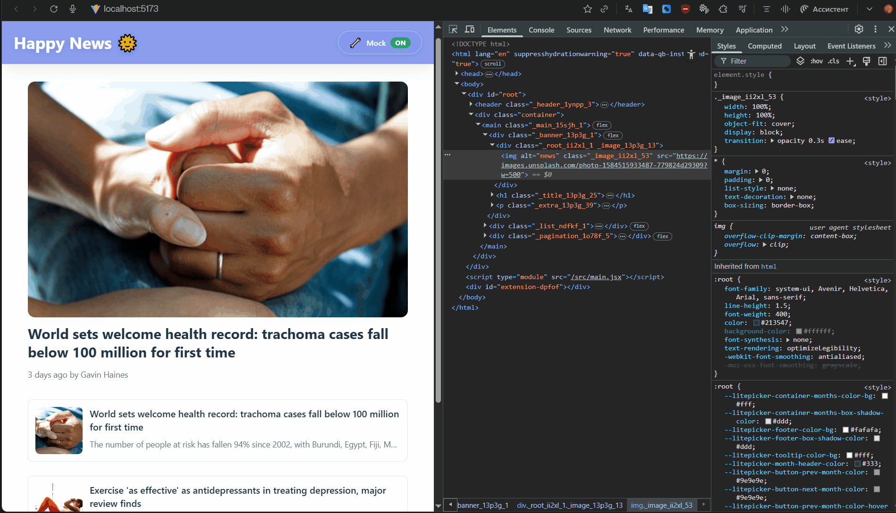

# react-happy-news

Описание проекта

<!-- AUTOGENERATED_SECTION START -->
## 📋 История версий

### 🟢 v1.3.0

**Демо работы**  


**Функционал:**
- сделал базовую пагинацию для новостей

**Релиз:** https://github.com/vv0rkz/react-happy-news/releases/tag/v1.3.0

---

### 🟢 v1.2.0

**Демо работы**  


**Функционал:**
- сделаны моки для первого запроса, чтобы работало без бэка

**Релиз:** https://github.com/vv0rkz/react-happy-news/releases/tag/v1.2.0

---

### 🟢 v1.1.0

**Демо работы**  


**Функционал:**
- добавлен skeleton для новостей
- обновлен skeleton

**Релиз:** https://github.com/vv0rkz/react-happy-news/releases/tag/v1.1.0

---

### 🟢 v1.0.0

**Демо работы**  


**Функционал:**
- добалено базовое представление NewsBanner
- добавлена базовая фильтрация на позитивные новости
- сделал базовое отображение списка новостей

**Релиз:** https://github.com/vv0rkz/react-happy-news/releases/tag/v1.0.0

---

<!-- AUTOGENERATED_SECTION END -->

## 🛠️ Для разработчиков

### 📋 Workflow разработки

```
[ Придумал фичу / Нашёл баг ]
        ↓
[ Создание задачи ] → npm run _ create-task/create-bug
        ↓
[ Разработка в ветке vX.Y.Z-description ]
        ↓
[ Коммиты с валидацией ] → feat/fix: #номер описание
        ↓
[ Добавление демо ] → docs/vX.Y.Z.gif
        ↓
[ Релиз ] → npm run _ release
        ↓
[ Авто-обновление CHANGELOG, README ]
```

**🚀 Пример (калькулятор):**

```bash
# 1) Создание задачи
npm run _ create-task "Нормализация чисел: 0123 → 123"
# → Создаётся issue #9

# 2) Создание ветки в формате vX.Y.Z-description
git checkout -b v2.3.0-normalize-numbers

# 3) Коммиты в формате feat: #N (где #N номер созданного issue)
git commit -m "feat: #9 добавлена нормализация чисел"

# 4) Релиз
npm run _ release
# ✅ Создаётся:
#   - CHANGELOG.md с фичей #9
#   - Git tag v2.3.0
#   - README обновляется автономно
```

## 📋 Бэклог задач

- [Открытые задачи (tasks)](https://github.com/vv0rkz/react-happy-news/issues?q=is:open+is:issue+label:task)
- [Активные баги (bugs)](https://github.com/vv0rkz/react-happy-news/issues?q=is:open+is:issue+label:bug)
- [Все issues](https://github.com/vv0rkz/react-happy-news/issues)

## 🔧 Workflow

Проект использует [@vv0rkz/js-template](https://github.com/vv0rkz/js-template) для автоматизации:

- ✅ Git hooks (husky) — проверка коммитов
- ✅ Changelog генерация (changelogen)
- ✅ GitHub issues integration
- ✅ Автоматическое обновление версий

## 📄 Лицензия

MIT © [vv0rkz](https://github.com/vv0rkz/react-happy-news)

---

README.md создано с помощью [@vv0rkz/js-template](https://github.com/vv0rkz/js-template)
