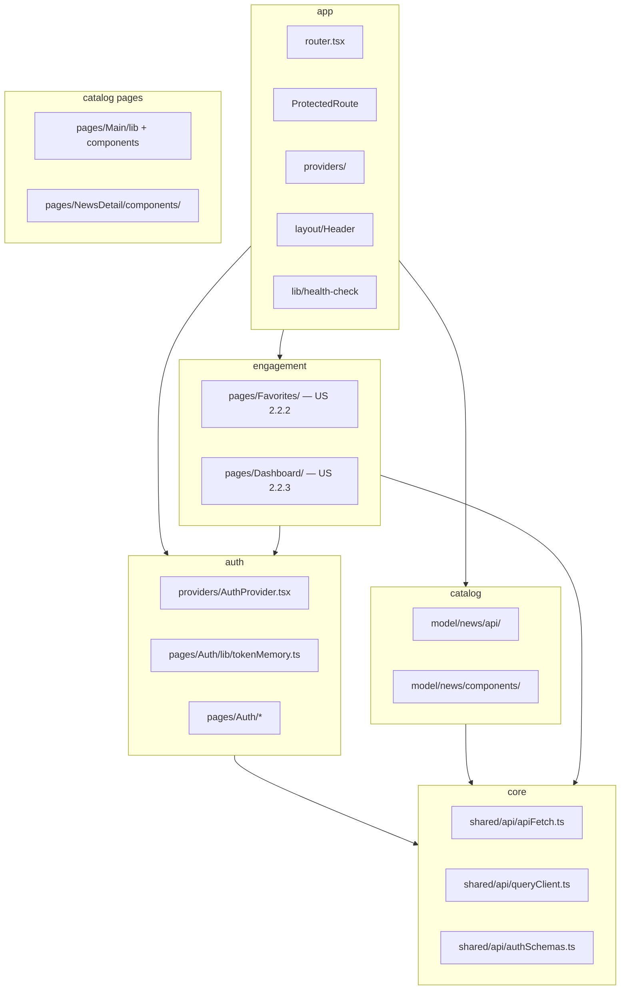

# Module Map — React Happy News (frontend)

> Living diagram. Без аналогий — только модули и зависимости.
> Решение зафиксировано в [ADR-001](./ADR-001-frontend-module-map.md).

## Принцип

**Module Map lite** — не strict flat FSD, не DDD. Четыре домена + `app` shell.

**Colocation rule:** код живёт рядом со страницей (`pages/Feature/`). Extract в `features/` — только при **2+ consumer zones** (разные pages / app / model). Код в `shared/` — только при **2+ zones**; иначе colocate.

Folder convention: [GOVERNANCE.md](./GOVERNANCE.md) + `pnpm arch:lint` (single source of truth: `client/scripts/arch-lint.mjs`).

## Модули



| Модуль         | Ответственность                             | Ключевые пути                                                                                      |
| -------------- | ------------------------------------------- | -------------------------------------------------------------------------------------------------- |
| **core**       | HTTP, query client, shared Zod schemas      | `shared/api/`                                                                                      |
| **auth**       | Сессия, forms, tokenMemory                  | `pages/Auth/`, `app/providers/AuthProvider.tsx`                                                    |
| **catalog**    | Новости, фильтры, деталь                    | `model/news/{api,components,lib}/`, `pages/Main/{lib,components}/`, `pages/NewsDetail/`          |
| **engagement** | Избранное, tracker, streak                  | `pages/Favorites/`, `pages/Dashboard/`                                                             |
| **app**        | Router, layout, health, providers, MSW boot | `app/`, `app/layout/Header/`, `app/lib/health-check/`                                              |

## Зависимости (правила)

1. `catalog` и `engagement` → `core` (apiFetch)
2. `engagement` → `auth` (protected routes, user id)
3. `auth` → `core` (apiFetch, schemas)
4. `app` → все модули (wiring only)
5. **Запрещено:** `core` → `auth` / `catalog` / `engagement`

## Page layout (catalog)

```
pages/Main/
├── Main.tsx
├── lib/                    # useNewsFilterParams, categories
└── components/
    ├── SearchInput/
    ├── NewsFilterBar/
    ├── NewsFeed/
    └── NewsFeedView/

pages/NewsDetail/
├── NewsDetail.tsx
└── components/
    ├── NewsDetailView/
    └── ReadersCount/       # + useLiveReaders.ts (widget VM)
```

Page VM → `lib/`. Widget VM → рядом с tsx в `components/<Name>/`.

## Физическая раскладка `shared`

| Подпапка              | Назначение                                      |
| --------------------- | ----------------------------------------------- |
| `shared/api/`         | **core** — HTTP, QueryClient, OpenAPI           |
| `shared/config/`      | routes и прочий config                          |
| `shared/components/`  | UI-kit (Skeleton, ErrorComponent) — 2+ zones    |
| `shared/lib/`         | pure utils — 2+ zones                           |

Запрещённые segments: `ui/`, `hooks/`, `helpers/`, `widgets/`. Слой FSD `widgets/` **не используется** — shell в `app/layout/`.

## FSD aliases (совместимость)

Tsconfig aliases: `@app`, `@pages`, `@features`, `@model`, `@shared`. Слои: `app → pages → features → model → shared`. Module Map — **логическая** группировка поверх физических папок.

## Enforcement

Автопроверки: [GOVERNANCE.md](./GOVERNANCE.md) — `pnpm lint:arch`, `pnpm arch:lint`, `pnpm arch:validate`, `pnpm arch:report`.

## Backend (кратко)

```
server/src/
├── routes/auth.routes.ts      — auth module
├── routes/news.routes.ts      — catalog module
├── routes/favorites.routes.ts — engagement (US 2.2.2)
└── middleware/authenticate.ts — auth → catalog/engagement
```

## Changelog

| Дата    | Изменение                                                                                               |
| ------- | ------------------------------------------------------------------------------------------------------- |
| 2026-05 | Initial Module Map lite (Auth Foundation docs v5)                                                       |
| 2026-05 | Physical layout: `app/layout/Header`, `entities/news/ui`, `shared/{hooks,ui,lib}`; ESLint + dep-cruiser |
| 2026-05 | Unified `components/` segment; `arch:lint` pre-push; colocation hooks/lib; docs → `model/`              |

## Follow-up (code)

Дубликаты `src/entities/`, mixed `@entities`/`@model` imports, eslint zones `entities` → отдельный PR (см. ADR-001).
