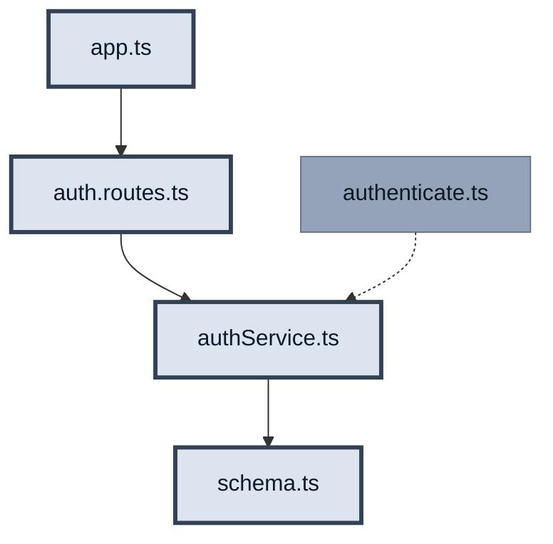
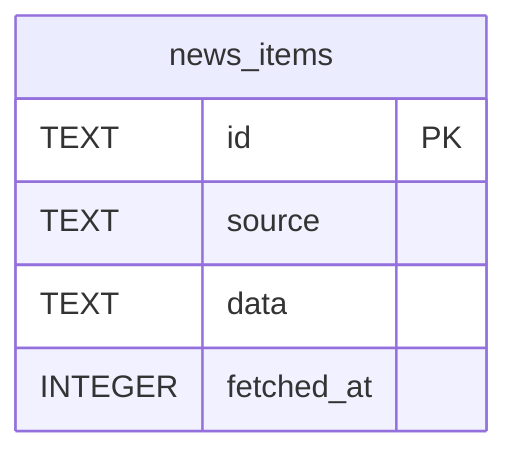
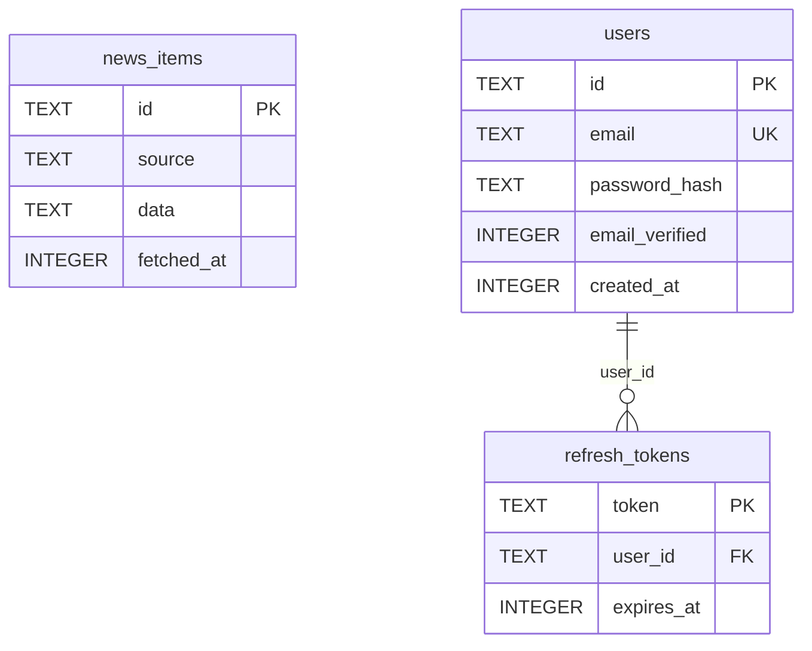

# US 2.2.1 — Backend Auth

**Статус:** `done`  
**Релиз:** [CURRENT_RELEASE.md](./CURRENT_RELEASE.md) — v2.2 Персонализация  
**Релиз-трекер:** таблица #1–#6 в [CURRENT_RELEASE.md](./CURRENT_RELEASE.md)  
**Полная спека:** [ROADMAP.md](./ROADMAP.md) — § US 2.2.1, под-инкремент 1  
**Справочник:** [auth/AUTH_REFERENCE.md](./auth/AUTH_REFERENCE.md)  
**Practice:** [guides/PRACTICE_MODE.md](./guides/PRACTICE_MODE.md)  
**Токены/JWT:** [guides/TOKENS_AND_JWT.md](./guides/TOKENS_AND_JWT.md)  
**Issue:** #73

**Acceptance Criteria (только этот US):**

- [x] `POST /api/auth/register` — email + password → аккаунт + tokens
- [x] `POST /api/auth/login` → access + refresh tokens
- [x] `POST /api/auth/refresh` → новый access (+ rotation refresh)
- [x] `POST /api/auth/logout` → очистка refresh cookie + удаление из БД
- [x] Пароль: bcrypt cost 12
- [x] Refresh: httpOnly cookie (7 дней, SameSite=Strict)
- [x] Rate-limit 5 req/min per IP на `/api/auth/*`

> **Не в этом US:** `authenticate.ts`, React, tokenMemory — [ROADMAP.md](./ROADMAP.md) § US 2.2.1, под-инкремент 2

---

## На схеме

**Мастер-схема:** D — Backend SOLID ([AUTH_REFERENCE §D](./auth/AUTH_REFERENCE.md))

**В этом US:**

| Файл | Действие |
| ---- | -------- |
| `schema.ts` | изменить |
| `authService.ts` | новый |
| `auth.routes.ts` | новый |
| `app.ts` | изменить |

**Не в этом US:** `authenticate.ts` (middleware — позже)

**После US:** curl register → login → refresh → logout → 401  
**Сцена timeline:** — (server-only; UI в US #3 Forms)  
**Полная карта:** [AUTH_REFERENCE.md](./auth/AUTH_REFERENCE.md)

| Статус | Фон | Обводка | Текст |
| ------ | --- | ------- | ----- |
| done | нет (default) | тонкая `#64748b` | default |
| **active (WIP)** | `#dce4ef` | жирная `#334155` | `#0f172a` |
| later | `#94a3b8` | тонкая `#64748b` | `#0f172a` |



---

## Зачем этот US

Стойка check-in на server: register/login/refresh/logout. Без этих endpoints client некуда слать credentials. Это **#1 из 6** auth-трека — фундамент для tokenMemory и форм в следующих US.

---

## Git

**Ветка:** `v2.2.0-auth`  
**Issue:** TBD

---

## Практика

### Шаг 0: deps

```bash
pnpm --filter react-happy-news-server add bcrypt jsonwebtoken cookie-parser express-rate-limit
pnpm --filter react-happy-news-server add -D @types/bcrypt @types/jsonwebtoken @types/cookie-parser
```

Добавить в `server/.env.example`: `JWT_ACCESS_SECRET`, `JWT_REFRESH_SECRET` (или один `JWT_SECRET`).

---

#### Схема БД (до / после)

##### Before (baseline в репо)



Индекс: `idx_fetched_at` на `news_items(fetched_at)`.  
PRAGMA: только `journal_mode = WAL`.

##### After (после реализации US 2.2.1)



##### Таблица diff

| | До | После US 2.2.1 |
| --- | --- | --- |
| Таблицы | `news_items` | + `users`, `refresh_tokens` |
| `news_items` | без изменений | без изменений |
| PRAGMA | `journal_mode = WAL` | + `foreign_keys = ON` (до `CREATE` с `REFERENCES`) |
| Связи | — | `refresh_tokens.user_id` → `users.id` |

**Подводный камень:** без `db.pragma('foreign_keys = ON')` SQLite **не проверяет** `REFERENCES` — FK только «на бумаге».

##### Проверка визуально

1. Реализуй `schema.ts` по Practice-блоку ниже.
2. Запусти `pnpm dev:server` (создаст/обновит `server/news.db`).
3. Открой `server/news.db` в [DB Browser for SQLite](https://sqlitebrowser.org/) или расширении SQLite в VS Code.
4. Вкладка **Browse Data** — таблицы; **Database Structure** — ER-подобный список.
5. В CLI (если установлен `sqlite3`):

```bash
sqlite3 server/news.db ".schema"
```

Ожидаешь `CREATE TABLE users`, `CREATE TABLE refresh_tokens` и прежний `news_items`.

Общие правила ER и шаблон для следующих US: [guides/DB_SCHEMA_DIFF.md](./guides/DB_SCHEMA_DIFF.md).

### `server/src/db/schema.ts`

```typescript
// ====== КОД ИЗ baseline (без изменений) ======
// import Database from 'better-sqlite3'
// export const db = new Database(DB_PATH)
// db.pragma('journal_mode = WAL')
// CREATE TABLE news_items ...
// CREATE INDEX idx_fetched_at ...

// ====== НОВЫЙ/ИЗМЕНЁННЫЙ БЛОК US 2.2.1 Backend ======
// db.pragma('foreign_keys = ON')  — ДО CREATE с FK

// CREATE TABLE users (
//   id TEXT PRIMARY KEY,
//   email TEXT UNIQUE NOT NULL,
//   password_hash TEXT NOT NULL,
//   email_verified INTEGER DEFAULT 0,
//   created_at INTEGER NOT NULL
// )

// CREATE TABLE refresh_tokens (
//   token TEXT PRIMARY KEY,
//   user_id TEXT NOT NULL REFERENCES users(id),
//   expires_at INTEGER NOT NULL
// )
```

---

### `server/src/services/authService.ts` (НОВЫЙ)

```typescript
// ====== НОВЫЙ/ИЗМЕНЁННЫЙ БЛОК US 2.2.1 Backend ======

export function register(email: string, password: string) {
  // Шаг 1: bcrypt.hash(password, 12) → password_hash
  // Шаг 2: INSERT INTO users
  // Шаг 3: создать access JWT (15m) + refresh token (7d, random string)
  // Шаг 4: INSERT refresh_tokens; вернуть { accessToken, refreshToken }
}

export function login(email: string, password: string) {
  // Шаг 1: find user by email
  // Шаг 2: bcrypt.compare — даже если user null, compare с dummy hash (anti-enumeration)
  // Шаг 3: при успехе — те же tokens что register; иначе throw 401 "Invalid credentials"
}

export function refresh(oldRefreshToken: string) {
  // Шаг 1: найти token в refresh_tokens, проверить expires_at
  // Шаг 2: rotation — DELETE старый, INSERT новый refresh
  // Шаг 3: новый access JWT + новый refresh
}

export function logout(refreshToken: string) {
  // Шаг 1: DELETE FROM refresh_tokens WHERE token = ?
}
```

**Подводный камень (login):** одинаковый 401 и ~время при неверном email и пароле.

---

### `server/src/routes/auth.routes.ts` (НОВЫЙ)

Образец структуры: [`server/src/routes/feedback.routes.ts`](../../server/src/routes/feedback.routes.ts).

```typescript
// ====== КОД ИЗ baseline (паттерн feedback.routes) ======
// registry.registerPath({ method, path, tags, request, responses })
// export const feedbackRouter = Router()
// safeParse → 400

// ====== НОВЫЙ/ИЗМЕНЁННЫЙ БЛОК US 2.2.1 Backend ======
// export const authRouter = Router()
// rateLimit: 5 req/min per IP

authRouter.post('/register', (req, res) => {
  // Шаг 1: Zod safeParse { email, password }
  // Шаг 2: authService.register → 201 { accessToken } + Set-Cookie refresh
  // Шаг 3: duplicate email → 409; invalid body → 400
})

authRouter.post('/login', (req, res) => {
  // Шаг 1: Zod + authService.login
  // Шаг 2: 200 { accessToken } + Set-Cookie (httpOnly, sameSite strict, maxAge 7d)
})

authRouter.post('/refresh', (req, res) => {
  // Шаг 1: refresh token из req.cookies
  // Шаг 2: authService.refresh → 200 + rotation cookie
})

authRouter.post('/logout', (req, res) => {
  // Шаг 1: authService.logout + clearCookie
  // Шаг 2: 200 { ok: true }
})
```

---

### `server/src/app.ts`

```typescript
// ====== КОД ИЗ baseline (без изменений) ======
// export function createApp() { morgan, cors, express.json, /api/news, /api/feedback, errorHandler }

// ====== НОВЫЙ/ИЗМЕНЁННЫЙ БЛОК US 2.2.1 Backend ======
export function createApp() {
  // Шаг 1: cors({ origin: allowedOrigins, credentials: true })
  // Шаг 2: app.use(cookieParser()) — до auth routes
  // Шаг 3: app.use('/api/auth', authRouter)
}
```

---

## Проверка и тесты

> US **не закрывается** без `- [ ]` ниже.

### Ручная (обязательно)

| # | Input | Output |
| - | ----- | ------ |
| 1 | POST `/api/auth/register` `{email, password}` | 201 + `{accessToken}` + Set-Cookie refresh |
| 2 | POST `/api/auth/login` | 200 + tokens |
| 3 | POST `/api/auth/refresh` с cookie | новый `accessToken` |
| 4 | POST `/api/auth/logout` | cookie cleared |
| 5 | POST `/api/auth/refresh` после logout | **401** |

- [x] register — `-v` показывает Set-Cookie httpOnly
- [x] login
- [x] refresh
- [x] logout
- [x] refresh после logout → 401
- [x] duplicate register → 409
- [x] неверный login → 401 «Invalid credentials»

### Автотесты (по ситуации)

Server test runner **пока нет** — curl достаточен для закрытия US #1. Рекомендуется unit на service:

- [x] `server/src/services/authService.test.ts` — register/login/refresh/logout (mock db)

```typescript
describe('authService.register', () => {
  it('returns accessToken and stores refresh in db', () => {
    // Arrange: in-memory sqlite или mock prepare()
    // Act: register(validEmail, validPassword)
    // Assert: accessToken defined; row in users; row in refresh_tokens
  })
})

describe('authService.login', () => {
  it('returns same 401 for unknown email and wrong password', () => {
    // Assert: anti-enumeration — один message, ~similar timing
  })
})
```

`server/src/routes/auth.routes.test.ts` + supertest — **только если** добавишь vitest на server; иначе пропустить.

---

## Запуск

```bash
# Терминал 1
pnpm dev:server

# Терминал 2 — после реализации всех файлов Практики
curl -X POST http://localhost:3001/api/auth/register \
  -H "Content-Type: application/json" \
  -d '{"email":"test@example.com","password":"Secret1pass"}' -c cookies.txt -v

curl -X POST http://localhost:3001/api/auth/login \
  -H "Content-Type: application/json" \
  -d '{"email":"test@example.com","password":"Secret1pass"}' -c cookies.txt

curl -X POST http://localhost:3001/api/auth/refresh -b cookies.txt -c cookies.txt

curl -X POST http://localhost:3001/api/auth/logout -b cookies.txt

curl -X POST http://localhost:3001/api/auth/refresh -b cookies.txt   # ожидаем 401

# type-check server
pnpm --filter react-happy-news-server build

# Swagger (после OpenAPI registry)
# http://localhost:3001/api/docs
```

```bash
git add server/src/ server/.env.example
git commit -m "feat: #N auth backend — schema, authService, routes, rate-limit"
```

---

## Самопроверка US

| # | Вопрос | Где в коде |
| - | ------ | ---------- |
| 4.1 | bcrypt cost 12? | `authService.ts` |
| 4.2 | Одинаковый ответ при неверном email/пароле? | `authService.login` |
| 4.4 | rate-limit на /auth? | `auth.routes.ts` |
| 4.5 | foreign_keys ON? | `schema.ts` |
| 4.6 | Register 409? | `auth.routes.ts` |

<details>
<summary>Эталоны</summary>

**4.1** — cost 12 баланс security/CPU.  
**4.2** — anti-enumeration: всегда 401 «Invalid credentials».  
**4.4** — защита brute-force.  
**4.5** — без PRAGMA orphan refresh_tokens.  
**4.6** — 409 Conflict если email занят.

</details>

## Следующий US

После commit + все `- [ ]` проверки → отметить #1 **done** в [CURRENT_RELEASE.md](./CURRENT_RELEASE.md); скопировать [INCREMENT_TEMPLATE.md](./templates/INCREMENT_TEMPLATE.md) в этот файл и заполнить из [ROADMAP.md](./ROADMAP.md) — **Под-инкремент 2: Client Session**.
