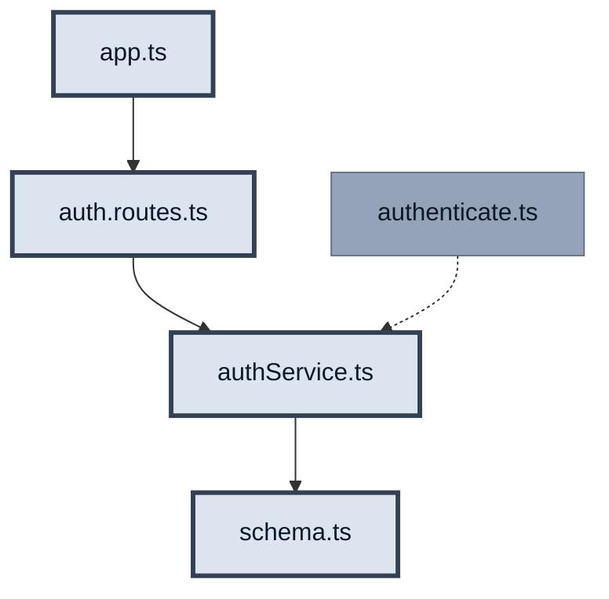
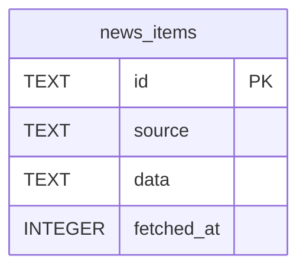
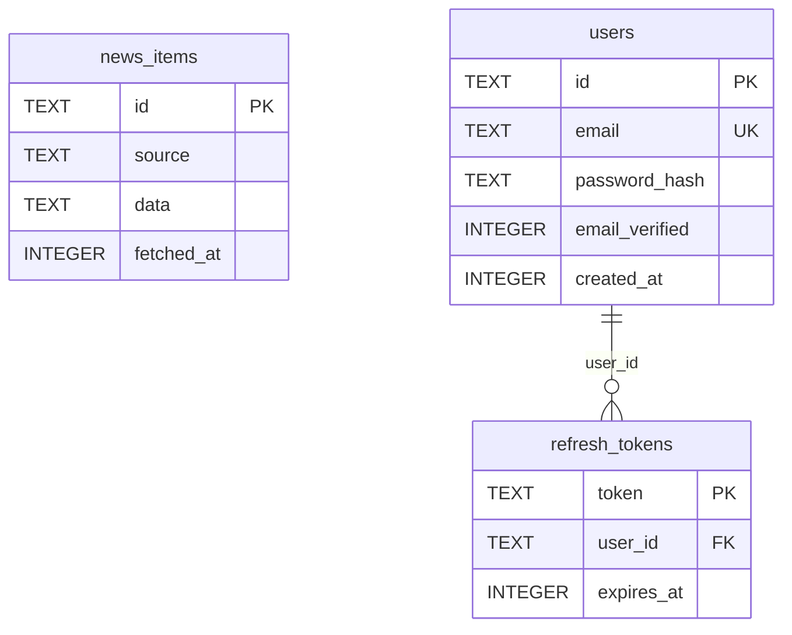
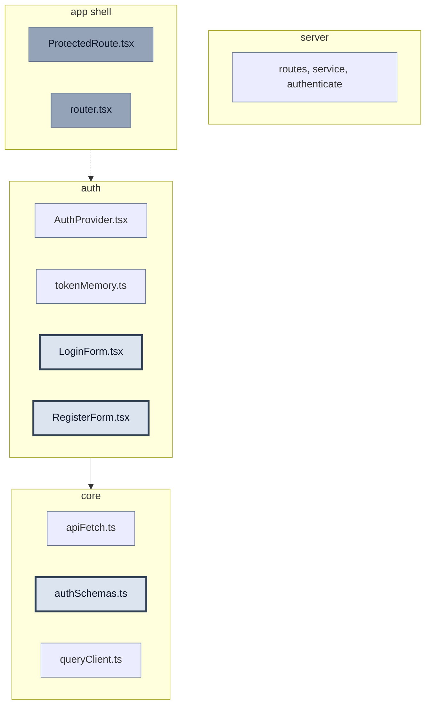
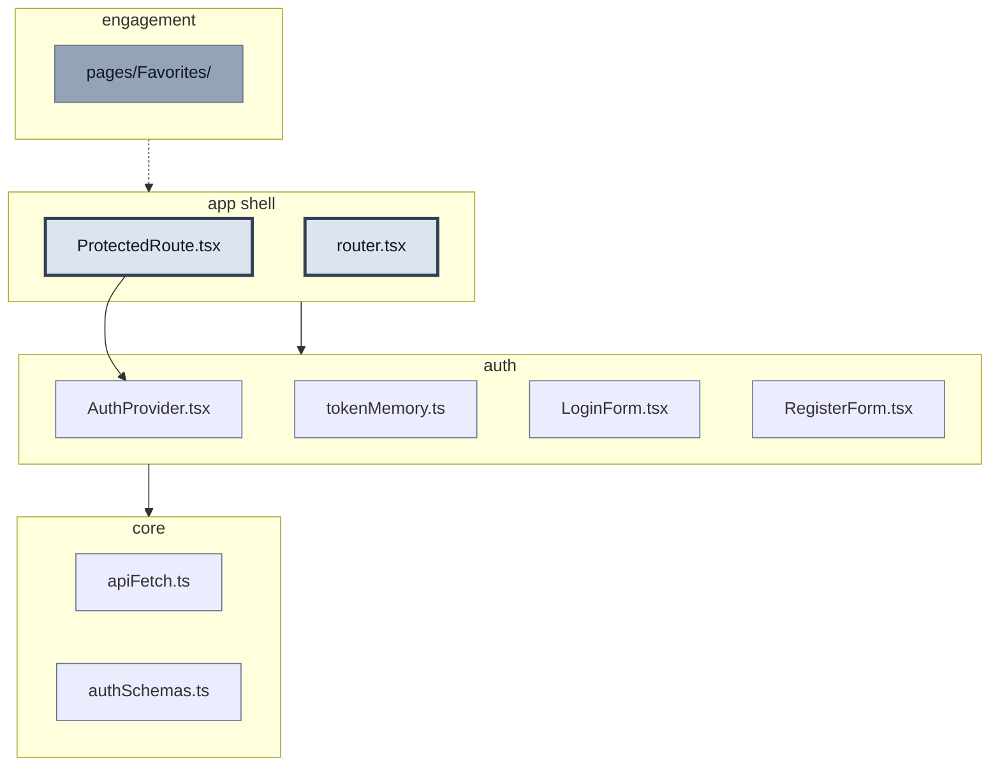
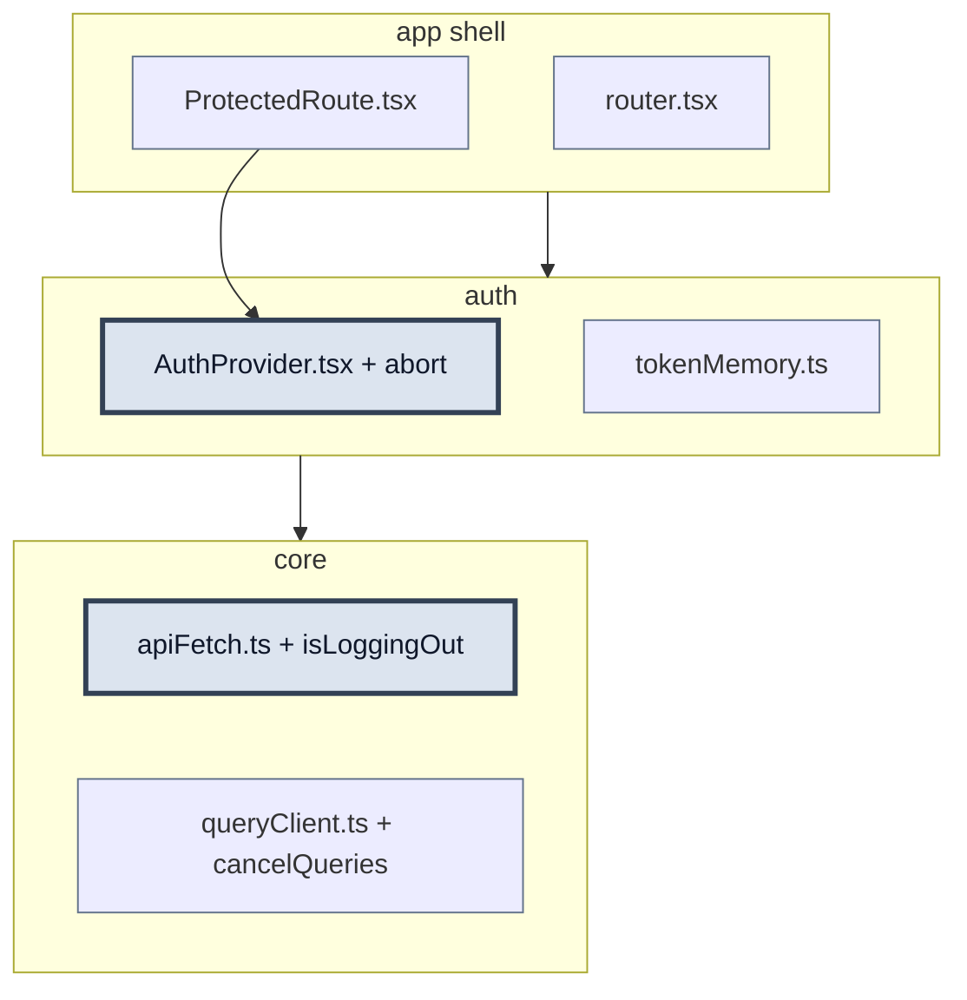
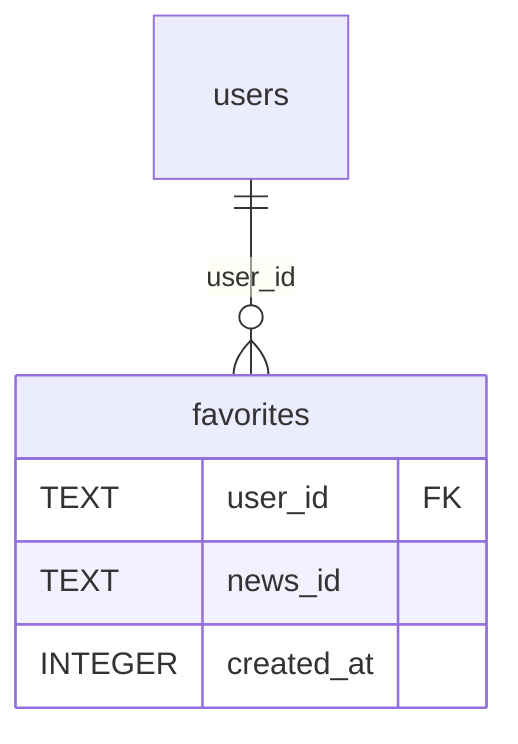
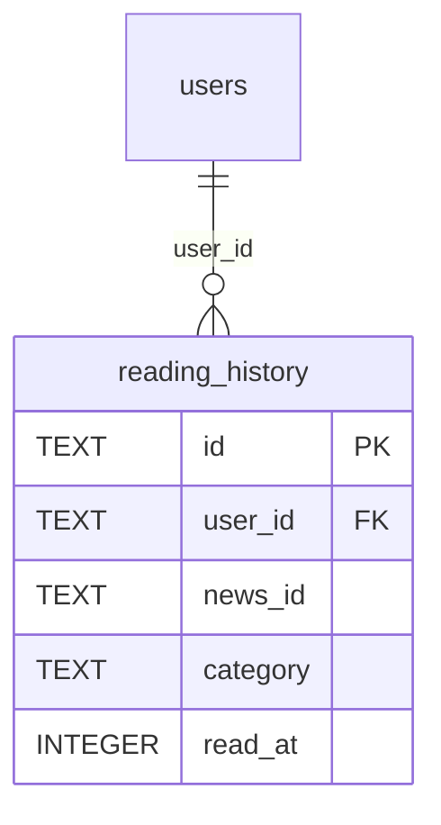

# React Happy News — Релиз v2.2 — Персонализация

**Статус:** `in progress`
**Ветка релиза:** `v2.2.0-auth`
**Long-term roadmap:** [ROADMAP.md](./ROADMAP.md) — обзор релизов v2.0–v2.7
**Рабочий инкремент:** [CURRENT_INCREMENT.md](./CURRENT_INCREMENT.md) — активный шаг + WIP-прогресс
**Справочник auth:** [auth/AUTH_REFERENCE.md](./auth/AUTH_REFERENCE.md)
**Покрытие:** Auth, JWT, bcrypt, TanStack Query, React Router, RHF, избранное, Positivity Tracker
**Оценка времени:** 5–6 дней

> **Примечание:** порядок релизов скорректирован — Auth реализуется раньше WebSocket-реакций.
> WS-реакции (ранее v2.2) перенесены в v2.3.

---

## Зачем

Пользователь получает аккаунт: может сохранять новости в **избранное**, видеть персональную статистику позитивности и стрик. Все последующие фичи (WS-реакции, Premium) строятся на идентификации пользователя.

---

## Структура релиза

| Фаза | US | Когда | Статус |
| ---- | -- | ----- | ------ |
| **1. Auth Foundation** | 2.2.1 (#1–#2), 2.2.4 (#3), 2.2.5 (#4), 2.2.6 (#5), 2.2.13 (#6a/6b) | **Сейчас** | #1–#2 done, #3 active |
| **2. Персонализация** | 2.2.2 Избранное, 2.2.3 Positivity Tracker | После auth #1–#5 | pending |
| **3. Хвост релиза** | 2.2.9 GDPR | По приоритету | pending |
| **Не в scope v2.2** | 2.2.7, 2.2.8, 2.2.10 | — | superseded / cancelled |

### Auth-трекер (#1–#6)

| # | US | Содержание | Статус |
| - | -- | ---------- | ------ |
| 1 | 2.2.1 | Backend: schema, authService, routes | **done** |
| 2 | 2.2.1 | Session: authenticate + `/me` → tokenMemory + apiFetch + AuthProvider | **done** |
| 3 | 2.2.4 | RHF + Zod forms | **active** |
| 4 | 2.2.5 | ProtectedRoute + lazy Auth | pending |
| 5 | 2.2.6 | SameSite, abort on logout | pending |
| 6a | 2.2.13 | Managed Auth — ADR, выбор провайдера | pending |
| 6b | 2.2.13 | Managed Auth — миграция client + Express JWKS | pending |

> **#6** заменяет US 2.2.10. **Предусловие #6:** инкременты **#2–#5** ✅. ADR: [auth/MANAGED_AUTH_ADR.md](./auth/MANAGED_AUTH_ADR.md)

**Текущий инкремент:** [CURRENT_INCREMENT.md](./CURRENT_INCREMENT.md) — Session #2 ✅ → следующий: **#3 Auth Forms**

---

## Фаза 1: Auth Foundation

<a id="increment-1"></a>
### Инкремент #1: Backend Auth (US 2.2.1)

**Статус:** `done`  
**Токены/JWT:** [guides/TOKENS_AND_JWT.md](./guides/TOKENS_AND_JWT.md)  
**Issue:** #73

**Acceptance Criteria (только этот US):**

- [ ] `POST /api/auth/register` — email + password → аккаунт + tokens
- [ ] `POST /api/auth/login` → access + refresh tokens
- [ ] `POST /api/auth/refresh` → новый access (+ rotation refresh)
- [ ] `POST /api/auth/logout` → очистка refresh cookie + удаление из БД
- [ ] Пароль: bcrypt cost 12
- [ ] Refresh: httpOnly cookie (7 дней, SameSite=Strict)
- [ ] Rate-limit 5 req/min per IP на `/api/auth/*`

> **Не в этом US:** `authenticate.ts`, React, tokenMemory — см. **Под-инкремент 2: Client Session** ниже

---

##### На схеме

**Мастер-схема:** D — Backend SOLID ([AUTH_REFERENCE §D](./auth/AUTH_REFERENCE.md))

**В этом US:**

| Файл | Действие |
| ---- | -------- |
| `schema.ts` | изменить |
| `authService.ts` | новый |
| `auth.routes.ts` | новый |
| `app.ts` | изменить |

**Не в этом US:** `authenticate.ts` (middleware — позже)

**После US:** curl register → login → refresh → logout → 401  
**Сцена timeline:** — (server-only; UI в US #3 Forms)  
**Полная карта:** [AUTH_REFERENCE.md](./auth/AUTH_REFERENCE.md)

| Статус | Фон | Обводка | Текст |
| ------ | --- | ------- | ----- |
| done | нет (default) | тонкая `#64748b` | default |
| **active (WIP)** | `#dce4ef` | жирная `#334155` | `#0f172a` |
| later | `#94a3b8` | тонкая `#64748b` | `#0f172a` |



---

##### Зачем этот US

Стойка check-in на server: register/login/refresh/logout. Без этих endpoints client некуда слать credentials. Это **#1 из 6** auth-трека — фундамент для tokenMemory и форм в следующих US.

---

##### Git

**Ветка:** `v2.2.0-auth`  
**Issue:** TBD

---

##### Практика

### Шаг 0: deps

```bash
pnpm --filter react-happy-news-server add bcrypt jsonwebtoken cookie-parser express-rate-limit
pnpm --filter react-happy-news-server add -D @types/bcrypt @types/jsonwebtoken @types/cookie-parser
```

Добавить в `server/.env.example`: `JWT_ACCESS_SECRET`, `JWT_REFRESH_SECRET` (или один `JWT_SECRET`).

---

#### Схема БД (до / после)

##### Before (baseline в репо)



Индекс: `idx_fetched_at` на `news_items(fetched_at)`.  
PRAGMA: только `journal_mode = WAL`.

##### After (после реализации US 2.2.1)



##### Таблица diff

| | До | После US 2.2.1 |
| --- | --- | --- |
| Таблицы | `news_items` | + `users`, `refresh_tokens` |
| `news_items` | без изменений | без изменений |
| PRAGMA | `journal_mode = WAL` | + `foreign_keys = ON` (до `CREATE` с `REFERENCES`) |
| Связи | — | `refresh_tokens.user_id` → `users.id` |

**Подводный камень:** без `db.pragma('foreign_keys = ON')` SQLite **не проверяет** `REFERENCES` — FK только «на бумаге».

##### Проверка визуально

1. Реализуй `schema.ts` по Practice-блоку ниже.
2. Запусти `pnpm dev:server` (создаст/обновит `server/news.db`).
3. Открой `server/news.db` в [DB Browser for SQLite](https://sqlitebrowser.org/) или расширении SQLite в VS Code.
4. Вкладка **Browse Data** — таблицы; **Database Structure** — ER-подобный список.
5. В CLI (если установлен `sqlite3`):

```bash
sqlite3 server/news.db ".schema"
```

Ожидаешь `CREATE TABLE users`, `CREATE TABLE refresh_tokens` и прежний `news_items`.

Общие правила ER и шаблон для следующих US: [guides/DB_SCHEMA_DIFF.md](./guides/DB_SCHEMA_DIFF.md).

### `server/src/db/schema.ts`

```typescript
// ====== КОД ИЗ baseline (без изменений) ======
// import Database from 'better-sqlite3'
// export const db = new Database(DB_PATH)
// db.pragma('journal_mode = WAL')
// CREATE TABLE news_items ...
// CREATE INDEX idx_fetched_at ...

// ====== НОВЫЙ/ИЗМЕНЁННЫЙ БЛОК US 2.2.1 Backend ======
// db.pragma('foreign_keys = ON')  — ДО CREATE с FK

// CREATE TABLE users (
//   id TEXT PRIMARY KEY,
//   email TEXT UNIQUE NOT NULL,
//   password_hash TEXT NOT NULL,
//   email_verified INTEGER DEFAULT 0,
//   created_at INTEGER NOT NULL
// )

// CREATE TABLE refresh_tokens (
//   token TEXT PRIMARY KEY,
//   user_id TEXT NOT NULL REFERENCES users(id),
//   expires_at INTEGER NOT NULL
// )
```

---

### `server/src/services/authService.ts` (НОВЫЙ)

```typescript
// ====== НОВЫЙ/ИЗМЕНЁННЫЙ БЛОК US 2.2.1 Backend ======

export function register(email: string, password: string) {
  // Шаг 1: bcrypt.hash(password, 12) → password_hash
  // Шаг 2: INSERT INTO users
  // Шаг 3: создать access JWT (15m) + refresh token (7d, random string)
  // Шаг 4: INSERT refresh_tokens; вернуть { accessToken, refreshToken }
}

export function login(email: string, password: string) {
  // Шаг 1: find user by email
  // Шаг 2: bcrypt.compare — даже если user null, compare с dummy hash (anti-enumeration)
  // Шаг 3: при успехе — те же tokens что register; иначе throw 401 "Invalid credentials"
}

export function refresh(oldRefreshToken: string) {
  // Шаг 1: найти token в refresh_tokens, проверить expires_at
  // Шаг 2: rotation — DELETE старый, INSERT новый refresh
  // Шаг 3: новый access JWT + новый refresh
}

export function logout(refreshToken: string) {
  // Шаг 1: DELETE FROM refresh_tokens WHERE token = ?
}
```

**Подводный камень (login):** одинаковый 401 и ~время при неверном email и пароле.

---

### `server/src/routes/auth.routes.ts` (НОВЫЙ)

Образец структуры: [`server/src/routes/feedback.routes.ts`](../../server/src/routes/feedback.routes.ts).

```typescript
// ====== КОД ИЗ baseline (паттерн feedback.routes) ======
// registry.registerPath({ method, path, tags, request, responses })
// export const feedbackRouter = Router()
// safeParse → 400

// ====== НОВЫЙ/ИЗМЕНЁННЫЙ БЛОК US 2.2.1 Backend ======
// export const authRouter = Router()
// rateLimit: 5 req/min per IP

authRouter.post('/register', (req, res) => {
  // Шаг 1: Zod safeParse { email, password }
  // Шаг 2: authService.register → 201 { accessToken } + Set-Cookie refresh
  // Шаг 3: duplicate email → 409; invalid body → 400
})

authRouter.post('/login', (req, res) => {
  // Шаг 1: Zod + authService.login
  // Шаг 2: 200 { accessToken } + Set-Cookie (httpOnly, sameSite strict, maxAge 7d)
})

authRouter.post('/refresh', (req, res) => {
  // Шаг 1: refresh token из req.cookies
  // Шаг 2: authService.refresh → 200 + rotation cookie
})

authRouter.post('/logout', (req, res) => {
  // Шаг 1: authService.logout + clearCookie
  // Шаг 2: 200 { ok: true }
})
```

---

### `server/src/app.ts`

```typescript
// ====== КОД ИЗ baseline (без изменений) ======
// export function createApp() { morgan, cors, express.json, /api/news, /api/feedback, errorHandler }

// ====== НОВЫЙ/ИЗМЕНЁННЫЙ БЛОК US 2.2.1 Backend ======
export function createApp() {
  // Шаг 1: cors({ origin: allowedOrigins, credentials: true })
  // Шаг 2: app.use(cookieParser()) — до auth routes
  // Шаг 3: app.use('/api/auth', authRouter)
}
```

---

##### Проверка и тесты

> US **не закрывается** без `- [ ]` ниже.

### Ручная (обязательно)

| # | Input | Output |
| - | ----- | ------ |
| 1 | POST `/api/auth/register` `{email, password}` | 201 + `{accessToken}` + Set-Cookie refresh |
| 2 | POST `/api/auth/login` | 200 + tokens |
| 3 | POST `/api/auth/refresh` с cookie | новый `accessToken` |
| 4 | POST `/api/auth/logout` | cookie cleared |
| 5 | POST `/api/auth/refresh` после logout | **401** |

- [ ] register — `-v` показывает Set-Cookie httpOnly
- [ ] login
- [ ] refresh
- [ ] logout
- [ ] refresh после logout → 401
- [ ] duplicate register → 409
- [ ] неверный login → 401 «Invalid credentials»

### Автотесты (по ситуации)

Server test runner **пока нет** — curl достаточен для закрытия US #1. Рекомендуется unit на service:

- [ ] `server/src/services/authService.test.ts` — register/login/refresh/logout (mock db)

```typescript
describe('authService.register', () => {
  it('returns accessToken and stores refresh in db', () => {
    // Arrange: in-memory sqlite или mock prepare()
    // Act: register(validEmail, validPassword)
    // Assert: accessToken defined; row in users; row in refresh_tokens
  })
})

describe('authService.login', () => {
  it('returns same 401 for unknown email and wrong password', () => {
    // Assert: anti-enumeration — один message, ~similar timing
  })
})
```

`server/src/routes/auth.routes.test.ts` + supertest — **только если** добавишь vitest на server; иначе пропустить.

---

##### Запуск

```bash
# Терминал 1
pnpm dev:server

# Терминал 2 — после реализации всех файлов Практики
curl -X POST http://localhost:3001/api/auth/register \
  -H "Content-Type: application/json" \
  -d '{"email":"test@example.com","password":"Secret1pass"}' -c cookies.txt -v

curl -X POST http://localhost:3001/api/auth/login \
  -H "Content-Type: application/json" \
  -d '{"email":"test@example.com","password":"Secret1pass"}' -c cookies.txt

curl -X POST http://localhost:3001/api/auth/refresh -b cookies.txt -c cookies.txt

curl -X POST http://localhost:3001/api/auth/logout -b cookies.txt

curl -X POST http://localhost:3001/api/auth/refresh -b cookies.txt   # ожидаем 401

# type-check server
pnpm --filter react-happy-news-server build

# Swagger (после OpenAPI registry)
# http://localhost:3001/api/docs
```

```bash
git add server/src/ server/.env.example
git commit -m "feat: #N auth backend — schema, authService, routes, rate-limit"
```

---

##### Самопроверка US

| # | Вопрос | Где в коде |
| - | ------ | ---------- |
| 4.1 | bcrypt cost 12? | `authService.ts` |
| 4.2 | Одинаковый ответ при неверном email/пароле? | `authService.login` |
| 4.4 | rate-limit на /auth? | `auth.routes.ts` |
| 4.5 | foreign_keys ON? | `schema.ts` |
| 4.6 | Register 409? | `auth.routes.ts` |

<details>
<summary>Эталоны</summary>

**4.1** — cost 12 баланс security/CPU.  
**4.2** — anti-enumeration: всегда 401 «Invalid credentials».  
**4.4** — защита brute-force.  
**4.5** — без PRAGMA orphan refresh_tokens.  
**4.6** — 409 Conflict если email занят.

</details>

---

<a id="increment-2"></a>
### Инкремент #2: Client Session (US 2.2.1)

**Статус:** `done`
**Предусловие:** Инкремент #1 Backend ✅


---

### Инкремент #3: Auth Forms (US 2.2.4) — Auth Forms (RHF + Zod)

**Статус:** `active` — WIP в [CURRENT_INCREMENT.md](./CURRENT_INCREMENT.md)  
**Issue:** TBD  
**Предусловие:** US 2.2.1 Client Session ✅

**Acceptance Criteria:**

- [ ] RHF + Zod на Login/Register
- [ ] `/login`, `/register` с валидацией
- [ ] Submit → POST `/api/auth/*`
- [ ] 409 → field error на register
- [ ] native `<form>` + autocomplete

---

#### На схеме

**Мастер-схема:** A — Module Map

**В этом US:**

| Файл | Действие |
| ---- | -------- |
| `LoginForm.tsx` | новый |
| `RegisterForm.tsx` | новый |
| `authSchemas.ts` | новый |

**Не в этом US:** `ProtectedRoute.tsx`, `router.tsx`

**После US:** UI login/register; submit → POST /api/auth/*  
**Сцена timeline:** Check-in login — POST /login → boarding pass + Set-Cookie  
**Полная карта:** [AUTH_REFERENCE](./AUTH_REFERENCE.md)

| Статус | Фон | Обводка | Текст |
| ------ | --- | ------- | ----- |
| done | нет (default) | тонкая `#64748b` | default |
| **active (WIP)** | `#dce4ef` | жирная `#334155` | `#0f172a` |
| later | `#94a3b8` | тонкая `#64748b` | `#0f172a` |



---

#### Зачем этот US

#1–#2 дали API и session layer. Здесь **UI check-in**: пользователь вводит email/password, RHF+Zod валидируют до запроса, submit идёт через AuthProvider/apiFetch.

---

#### Git

**Ветка:** `v2.2.0-auth`  
**Issue:** TBD

---

#### Практика

### Шаг 0: deps

```bash
pnpm --filter react-happy-news-client add react-hook-form @hookform/resolvers
```

---

### `client/src/shared/api/authSchemas.ts` (НОВЫЙ)

```typescript
import { z } from 'zod'

export const loginSchema = z.object({
  email: z.string().email('Invalid email'),
  password: z.string().min(1, 'Password required'),
})

export const registerSchema = z.object({
  email: z.string().email('Invalid email'),
  password: z
    .string()
    .min(8, 'Min 8 characters')
    .regex(/[A-Z]/, 'Need uppercase')
    .regex(/\d/, 'Need digit'),
})

export type LoginFormValues = z.infer<typeof loginSchema>
export type RegisterFormValues = z.infer<typeof registerSchema>
```

**Контракт submit:** `LoginForm` → `const { login } = useAuth()` → `await login(email, password)` (void; user из context).

---

### `client/src/pages/Auth/LoginForm.tsx` (НОВЫЙ)

```typescript
export function LoginForm() {
  // Шаг 1: useForm({ resolver: zodResolver(loginSchema) })
  // Шаг 2: onSubmit → AuthProvider.login или apiFetch POST /login
  // Шаг 3: native form; autocomplete email + current-password

  // render: form + email + password + submit
}
```

---

### `client/src/pages/Auth/RegisterForm.tsx` (НОВЫЙ)

```typescript
export function RegisterForm() {
  // Шаг 1: useForm + registerSchema
  // Шаг 2: server 409 → setError('email', { message: '...' })
  // Шаг 3: autocomplete new-password

  // render: form + fields + submit
}
```

---

### `client/src/pages/Auth/LoginPage.tsx` / `RegisterPage.tsx` (НОВЫЙ)

```typescript
export function LoginPage() {
  // render: LoginForm
}

export function RegisterPage() {
  // render: RegisterForm
}
```

---

### `client/src/app/router.tsx` — ИЗМЕНИТЬ

```typescript
// ====== ИЗМЕНЁННЫЙ БЛОК US 2.2.4 ======
// routes /login → LoginPage, /register → RegisterPage
// (React.lazy — в US 2.2.5)
```

**Подводный камень:** без `<form>` password manager не работает.

---

#### Проверка и тесты

### Ручная (обязательно)

| # | Input | Output |
| - | ----- | ------ |
| 1 | `/login` invalid email | validation errors, no request |
| 2 | `/login` valid credentials | logged in, token in memory |
| 3 | `/register` duplicate email | field error 409 |
| 4 | `/register` weak password | Zod error before submit |

- [ ] validation на login/register
- [ ] successful login
- [ ] 409 на register
- [ ] autocomplete attributes в DOM

### Автотесты (обязательно)

- [ ] `LoginForm.test.tsx` — validation + submit

```typescript
describe('LoginForm', () => {
  it('shows validation error for short password', () => {
    // render + userEvent → expect error text
  })
  it('calls login on valid submit', () => {
    // MSW POST /api/auth/login → 200
  })
})
```

- [ ] `RegisterForm.test.tsx` — 409 → field error

- [ ] MSW handlers `/api/auth/login`, `/register` в `handlers.ts`

```bash
pnpm --filter react-happy-news-client exec vitest run src/pages/Auth/LoginForm.test.tsx
pnpm --filter react-happy-news-client exec vitest run src/pages/Auth/RegisterForm.test.tsx
```

---

#### Запуск

```bash
pnpm dev
# браузер: http://localhost:5173/login , /register
pnpm --filter react-happy-news-client exec vitest run src/pages/Auth/LoginForm.test.tsx
```

```bash
git add client/src/pages/Auth/ client/src/shared/api/authSchemas.ts client/src/app/mocks/
git commit -m "feat: #N Auth forms — RHF + Zod + autocomplete"
```

---

#### Самопроверка US

1. RHF + Zod при двух полях? → FQ66, FQ67  
2. current-password vs new-password?  
3. Shared schema почему в `shared/api`?

---

### Инкремент #4: Protected Routes + Lazy Loading (US 2.2.5) — Protected Routes + Lazy Loading

**Статус:** `pending`  
**Issue:** TBD  
**Предусловие:** US 2.2.4 Forms ✅

**Acceptance Criteria:**

- [ ] `<ProtectedRoute>` для `/favorites`
- [ ] Гость → redirect `/login` с `state.from`
- [ ] После login → `navigate(from.pathname ?? '/')`
- [ ] React.lazy для Auth pages + Suspense

---

#### На схеме

**Мастер-схема:** A — Module Map

**В этом US:**

| Файл | Действие |
| ---- | -------- |
| `ProtectedRoute.tsx` | новый |
| `router.tsx` | изменить |

**Не в этом US:** `pages/Favorites/` (engagement — позже)

**После US:** gate `/favorites`; post-login return  
**Сцена timeline:** gate VIP-зал — без talon → стойка check-in  
**Полная карта:** [AUTH_REFERENCE](./AUTH_REFERENCE.md)

| Статус | Фон | Обводка | Текст |
| ------ | --- | ------- | ----- |
| done | нет (default) | тонкая `#64748b` | default |
| **active (WIP)** | `#dce4ef` | жирная `#334155` | `#0f172a` |
| later | `#94a3b8` | тонкая `#64748b` | `#0f172a` |



---

#### Зачем этот US

Forms дают check-in. **Authorization** — gate: гость не видит `/favorites`. Lazy — не грузить RHF chunk гостям на главной.

---

#### Git

**Ветка:** `v2.2.0-auth`  
**Issue:** TBD

---

#### Практика

### `client/src/app/router/ProtectedRoute.tsx` (НОВЫЙ)

```typescript
import { Navigate, Outlet, useLocation } from 'react-router-dom'
import { useAuth } from '@pages/Auth/lib/useAuth'

export type LoginRedirectState = {
  from?: { pathname: string }
}

export function ProtectedRoute() {
  const { isAuthenticated, isLoading } = useAuth()
  const location = useLocation()

  if (isLoading) {
    return null  // или <Spinner /> — НЕ редиректить до bootstrap
  }

  if (!isAuthenticated) {
    return <Navigate to="/login" replace state={{ from: location }} />
  }

  return <Outlet />
}
```

---

### `client/src/app/router.tsx` — ИЗМЕНИТЬ

```typescript
// ====== КОД ИЗ US 2.2.4 (без изменений) ======
// routes /login, /register

// ====== ИЗМЕНЁННЫЙ БЛОК US 2.2.5 ======
// React.lazy(() => import LoginPage, RegisterPage)
// Suspense fallback
// nested route: element ProtectedRoute → children /favorites
```

---

### `client/src/shared/config/routes.ts` — ИЗМЕНИТЬ

```typescript
// константы: LOGIN, REGISTER, FAVORITES
```

---

### `client/src/pages/Auth/LoginPage.tsx` — ИЗМЕНИТЬ

```typescript
export function LoginPage() {
  // после успешного login:
  // navigate(location.state?.from?.pathname ?? '/')
}
```

---

#### Проверка и тесты

### Ручная (обязательно)

| # | Input | Output |
| - | ----- | ------ |
| 1 | Гость открывает `/favorites` | redirect `/login`, URL state.from |
| 2 | Login после redirect | возврат на `/favorites` |
| 3 | Гость на `/` | Auth chunk не в initial bundle (Network) |

- [ ] redirect гостя
- [ ] post-login return
- [ ] lazy Auth pages

### Автотесты (обязательно)

- [ ] `ProtectedRoute.test.tsx`

```typescript
describe('ProtectedRoute', () => {
  it('redirects guest to /login with from state', () => {
    // mock useAuth → not authenticated → expect Navigate
  })
  it('renders Outlet when authenticated', () => {
    // mock useAuth → authenticated → Outlet visible
  })
})
```

```bash
pnpm --filter react-happy-news-client exec vitest run src/app/router/ProtectedRoute.test.tsx
```

---

#### Запуск

```bash
pnpm dev
# logout → /favorites → /login → login → /favorites
pnpm --filter react-happy-news-client exec vitest run src/app/router/ProtectedRoute.test.tsx
```

```bash
git add client/src/app/router/ client/src/shared/config/ client/src/pages/Auth/
git commit -m "feat: #N ProtectedRoute + lazy Auth pages"
```

---

#### Самопроверка US

1. Auth vs authz на `/favorites`?  
2. Зачем React.lazy?  
3. Где хранится `from`?

---

### Инкремент #5: Frontend Security (US 2.2.6) — Frontend Security

**Статус:** `pending`  
**Issue:** TBD  
**Предусловие:** US 2.2.5 Protected Routes ✅

**Acceptance Criteria:**

- [ ] Refresh cookie: `SameSite=Strict` (server)
- [ ] Logout during in-flight → abort, no refresh retry
- [ ] `queryClient.cancelQueries()` on logout
- [ ] AbortController on logout

---

#### На схеме

**Мастер-схема:** A + §F

**В этом US:**

| Файл | Действие |
| ---- | -------- |
| `apiFetch.ts` | изменить — isLoggingOut, abort |
| `AuthProvider.tsx` | изменить — abort on logout |

**После US:** logout прерывает in-flight; token cleared  
**Сцена timeline:** logout прерывает gate-запрос  
**Полная карта:** [AUTH_REFERENCE §F](./AUTH_REFERENCE.md)

| Статус | Фон | Обводка | Текст |
| ------ | --- | ------- | ----- |
| done | нет (default) | тонкая `#64748b` | default |
| **active (WIP)** | `#dce4ef` | жирная `#334155` | `#0f172a` |
| later | `#94a3b8` | тонкая `#64748b` | `#0f172a` |



---

#### Зачем этот US

Session работает (#1–#5). Здесь **закрываем дыры**: logout не должен trigger refresh retry; in-flight запросы abort; SameSite на cookie.

---

#### Git

**Ветка:** `v2.2.0-auth`  
**Issue:** TBD

---

#### Практика

### `server/src/routes/auth.routes.ts` — ИЗМЕНИТЬ

```typescript
// ====== ИЗМЕНЁННЫЙ БЛОК US 2.2.6 ======
// Set-Cookie: sameSite: 'strict' на refresh
```

---

### `client/src/shared/api/apiFetch.ts` — ИЗМЕНИТЬ

```typescript
// ====== КОД ИЗ US 2.2.1 Client (без изменений) ======
// export async function apiFetch(...) { credentials, Bearer, 401 refresh }

// ====== ИЗМЕНЁННЫЙ БЛОК US 2.2.6 ======
let isLoggingOut = false

export function setLoggingOut(value: boolean) {
  isLoggingOut = value
}

// requestWithAuth: if (isLoggingOut) throw — без refresh retry
// doFetch: передавать init?.signal в fetch
```

---

### `client/src/app/providers/AuthProvider.tsx` — ИЗМЕНИТЬ

```typescript
// ====== ИЗМЕНЁННЫЙ БЛОК US 2.2.6 ======
async function logout(): Promise<void> {
  // Шаг 1: setLoggingOut(true)
  // Шаг 2: queryClient.cancelQueries()
  // Шаг 3: abortController.abort() на in-flight fetches
  // Шаг 4: clearAccessToken + POST /logout
  // Шаг 5: setUser(null); setLoggingOut(false) в finally
}
```

---

#### Проверка и тесты

### Ручная (обязательно)

| # | Input | Output |
| - | ----- | ------ |
| 1 | Logout во время медленного GET /api/news | запрос aborted; token cleared; нет refresh retry |
| 2 | Cookie flags в DevTools | SameSite=Strict |

- [ ] logout during in-flight
- [ ] SameSite=Strict на refresh cookie
- [ ] DOMPurify в NewsDetail — уже есть

### Автотесты (обязательно)

- [ ] дополнить `apiFetch.test.ts`:

```typescript
describe('apiFetch logout', () => {
  it('does not retry refresh when isLoggingOut', () => {
    // set isLoggingOut → 401 → expect no POST /refresh
  })
  it('aborts fetch when signal aborted', () => {
    // AbortController.abort → rejected
  })
})
```

```bash
pnpm --filter react-happy-news-client exec vitest run src/shared/api/apiFetch.test.ts
```

---

#### Запуск

```bash
pnpm dev
# DevTools: Throttling Slow 3G → login → trigger news fetch → logout immediately
pnpm --filter react-happy-news-client exec vitest run src/shared/api/apiFetch.test.ts
```

```bash
git add server/src/routes/auth.routes.ts client/src/shared/api/ client/src/app/providers/
git commit -m "feat: #N auth security — SameSite, abort on logout"
```

---

#### Самопроверка US

1. SameSite=Strict зачем?  
2. Что без isLoggingOut?  
3. credentials + CORS оба side?

---

<a id="us-2-2-13"></a>
### US 2.2.13: Managed Identity (#6a / #6b)

**Статус:** `pending`
**Issue:** [#74](https://github.com/vv0rkz/react-happy-news/issues/74)
**Предусловие:** Auth #2–#5 ✅
**ADR:** [auth/MANAGED_AUTH_ADR.md](./auth/MANAGED_AUTH_ADR.md) — Decision TBD до 6a

#### Инкремент #6a: ADR + выбор провайдера

**Спека:** [auth/increments/US-2.2.13-6a-adr.md](./auth/increments/US-2.2.13-6a-adr.md)

#### Acceptance Criteria (6a)

- [ ] Матрица 7 вариантов заполнена в ADR
- [ ] Decision зафиксирован (Clerk default / Auth0 / DIY)
- [ ] ADR status: `proposed` → `accepted`
- [ ] Superseded: 2.2.7, 2.2.8, 2.2.10 для v2.2

#### Инкремент #6b: Миграция

**Спека:** [auth/increments/US-2.2.13-6b-migrate.md](./auth/increments/US-2.2.13-6b-migrate.md)

#### Acceptance Criteria (6b)

- [ ] Client: ClerkProvider / Auth0Provider; Bearer в apiFetch
- [ ] Server: authenticate → JWKS verify
- [ ] F5 без POST /api/auth/refresh
- [ ] Legacy POST /api/auth/login|register|refresh → 410
- [ ] Google login через dashboard провайдера
- [ ] pnpm gen:openapi:sync


---

## Фаза 2: Персонализация

<a id="us-2-2-2"></a>
### US 2.2.2: Избранное

**Статус:** `pending`
**Предусловие:** Auth #1–#5 ✅ (минимум: Session + ProtectedRoute для `/favorites`)
**Справочник:** [AUTH_REFERENCE.md](./auth/AUTH_REFERENCE.md) — authorization gate

**Как** авторизованный пользователь
**Я хочу** сохранять понравившиеся новости в избранное
**Чтобы** вернуться к ним позже

#### Acceptance Criteria

- [ ] `POST /api/favorites` — сохранить (body: `{ newsId }`)
- [ ] `GET /api/favorites` — список для текущего user
- [ ] `DELETE /api/favorites/:newsId` — удалить
- [ ] Кнопка «В избранное / Убрать» на карточке
- [ ] Страница `/favorites` со списком (за `ProtectedRoute`)

> **Не в этом US:** Positivity Tracker, React Profiler audit (см. optimization notes ниже)

#### На схеме

| Файл | Действие |
| ---- | -------- |
| `server/src/db/schema.ts` | + `favorites` table |
| `server/src/routes/favorites.routes.ts` | новый |
| `server/src/services/favoritesService.ts` | новый |
| `client/src/pages/Favorites/` | страница списка |
| `client/src/pages/Main/components/FavoriteButton.tsx` | toggle на карточке |
| `client/src/model/favorites/api/favoritesQueries.ts` | TanStack Query hooks |



#### Практика

##### Схема БД

```typescript
// CREATE TABLE favorites (
//   user_id TEXT NOT NULL REFERENCES users(id),
//   news_id TEXT NOT NULL,
//   created_at INTEGER NOT NULL,
//   PRIMARY KEY (user_id, news_id)
// )
```

##### API types

```typescript
export type FavoriteItem = {
  newsId: string
  createdAt: number
}

export type FavoritesListResponse = {
  items: FavoriteItem[]
}

export type AddFavoriteBody = { newsId: string }
```

##### `server/src/services/favoritesService.ts`

```typescript
export function addFavorite(userId: string, newsId: string) {
  // INSERT OR IGNORE / UPSERT
}

export function listFavorites(userId: string): FavoriteItem[] {
  // SELECT by user_id ORDER BY created_at DESC
}

export function removeFavorite(userId: string, newsId: string) {
  // DELETE WHERE user_id AND news_id
}
```

##### `server/src/routes/favorites.routes.ts`

```typescript
// Все routes: authenticate middleware
// POST /   → 201
// GET /    → 200 { items }
// DELETE /:newsId → 204
```

##### `client/src/model/favorites/api/favoritesQueries.ts`

```typescript
export function useFavoritesQuery() {
  // useQuery — GET /api/favorites через apiFetch
}

export function useToggleFavoriteMutation() {
  // useMutation — POST или DELETE; invalidate favorites + news list
}
```

##### React.memo / useCallback (оптимизация)

- `onToggleFavorite` — `useCallback` в родителе каталога
- `isFavorite` — отдельный `boolean` prop в `NewsItem` (не пересоздавать `item` без `useMemo`)
- React Profiler: до/после — 1 рендер затронутой карточки, не всей ленты

#### Проверка и тесты

| # | Input | Output |
| - | ----- | ------ |
| 1 | POST favorite с Bearer | 201 |
| 2 | GET favorites | список с newsId |
| 3 | DELETE favorite | 204, кнопка «В избранное» |
| 4 | Гость POST favorite | 401 |

- [ ] curl CRUD favorites
- [ ] UI toggle на карточке
- [ ] `/favorites` только для авторизованных

```typescript
describe('useToggleFavoriteMutation', () => {
  it('adds and removes favorite via MSW', () => {
    // POST /api/favorites → 201; DELETE → 204
  })
})
```

#### Запуск

```bash
pnpm dev
# login → toggle favorite на карточке → /favorites
```

```bash
git add server/src/routes/favorites* server/src/services/favorites* client/src/pages/Favorites client/src/model/favorites
git commit -m "feat: #N favorites CRUD + FavoriteButton"
```


<a id="us-2-2-3"></a>
### US 2.2.3: Positivity Tracker

**Статус:** `pending`
**Предусловие:** US 2.2.2 ✅ (или параллельно после auth #5)

#### Acceptance Criteria

- [ ] `POST /api/reading-history` — каждый просмотр статьи
- [ ] Страница `/dashboard`: прочитано за неделю / месяц
- [ ] Streak: «N дней подряд позитивных новостей»
- [ ] Топ тем, которые вдохновляют

#### На схеме

| Файл | Действие |
| ---- | -------- |
| `server/src/db/schema.ts` | + `reading_history` |
| `server/src/routes/readingHistory.routes.ts` | POST |
| `server/src/services/readingStatsService.ts` | агрегация |
| `client/src/pages/Dashboard/` | UI stats + streak |
| `client/src/pages/NewsDetail/` | track view on mount |



#### Практика

##### API types

```typescript
export type TrackReadBody = {
  newsId: string
  category?: string
}

export type DashboardStats = {
  weekCount: number
  monthCount: number
  streakDays: number
  topCategories: Array<{ category: string; count: number }>
}
```

##### `server/src/services/readingStatsService.ts`

```typescript
export function trackRead(userId: string, newsId: string, category?: string) {
  // INSERT reading_history (dedupe same day optional)
}

export function getDashboardStats(userId: string): DashboardStats {
  // COUNT week/month; streak = consecutive days with reads
  // GROUP BY category for top themes
}
```

##### Client hooks

```typescript
export function useTrackRead(newsId: string, category?: string) {
  // useEffect on NewsDetail mount → POST /api/reading-history (once)
}

export function useDashboardStats() {
  // useQuery GET /api/reading-history/stats
}
```

#### Проверка и тесты

- [ ] Открыть NewsDetail → POST reading-history в Network
- [ ] `/dashboard` показывает week/month/streak
- [ ] ProtectedRoute на `/dashboard`

#### Запуск

```bash
pnpm dev
# прочитать 2–3 статьи → /dashboard
```


---

## Не в scope v2.2 (superseded / cancelled)

| US | Статус | Причина |
| -- | ------ | ------- |
| 2.2.7 Email verification | ⏸️ SUPERSEDED | Verify через managed provider (2.2.13) |
| 2.2.8 Password reset | ⏸️ SUPERSEDED | Reset через managed provider (2.2.13) |
| 2.2.10 OAuth Google (passport) | ⏸️ CANCELLED | Заменён US 2.2.13 #6 |

### US 2.2.9: GDPR / Right to delete — ⏳ PENDING (фаза 3)

- [ ] `DELETE /api/account` — каскадное удаление данных пользователя
- [ ] Подтверждение через пароль в UI

---

## Закрываемые темы v2.2

**Backend:** JWT (access + refresh), bcrypt, httpOnly cookie, refresh-rotation, rate-limit auth endpoints

**Frontend:** TanStack Query, React Hook Form, Zod resolver, Protected Routes, React.lazy, useLayoutEffect, AbortController, Context + tokenMemory

---

## Следующий релиз

**v2.3 — Social & Engagement** (WS-реакции + anti-spam — для авторизованных пользователей) — после закрытия всех US этого релиза.

---

## Шаг ФИНАЛЬНЫЙ: Закрыть релиз

### 1. Записать демо-материалы

```bash
ls docs/demo/v2.2.0.gif
```

### 2. Сгенерировать CHANGELOG + тег + поднять версию

```bash
npm run _ release
```

### 3. Запушить тег + создать GitHub Release

```bash
npm run _ push-release
```

### 4. Обновить документацию

```bash
# CURRENT_RELEASE.md → статус DONE
# CURRENT_INCREMENT.md → первый US v2.3
git add docs/
git commit -m "docs: v2.2.0 released"
```

---

## Достаточность материалов (аудит)

| US / инкремент | AC | На схеме | Практика | Проверка | Запуск |
| -------------- | -- | -------- | -------- | -------- | ------ |
| #1 Backend | ✅ | ✅ | ✅ | ✅ | ✅ |
| #2 Session | ✅ | ✅ | ✅ | ✅ | ✅ |
| #3 Forms | ✅ | ✅ | ✅ (типы Zod) | ✅ | ✅ |
| #4 Protected | ✅ | ✅ | ✅ (ProtectedRoute props) | ✅ | ✅ |
| #5 Security | ✅ | ✅ | ✅ (isLoggingOut) | ✅ | ✅ |
| 2.2.2 Favorites | ✅ | ✅ | ✅ | ✅ | ✅ |
| 2.2.3 Tracker | ✅ | ✅ | ✅ | ✅ | ✅ |
| 2.2.13 #6a/6b | ✅ | ✅ | → increment files | ✅ | ✅ |
| 2.2.9 GDPR | ⚠️ AC only | — | pending при старте US | — | — |
