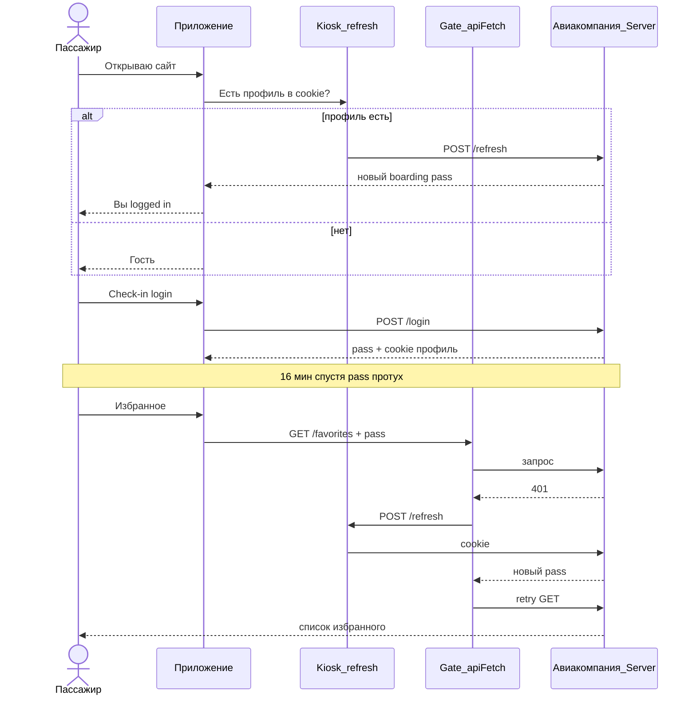
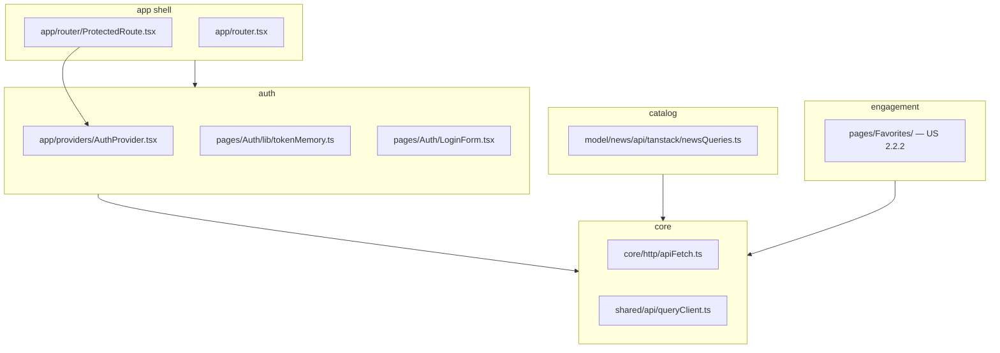
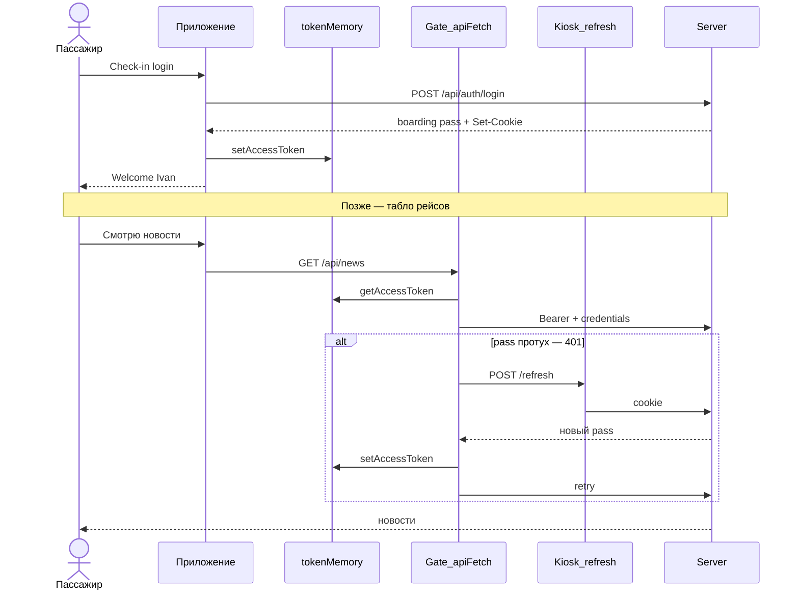
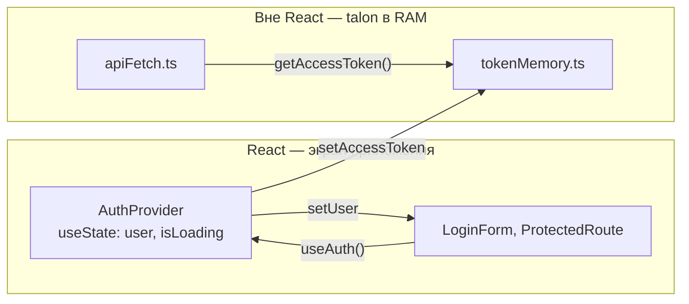
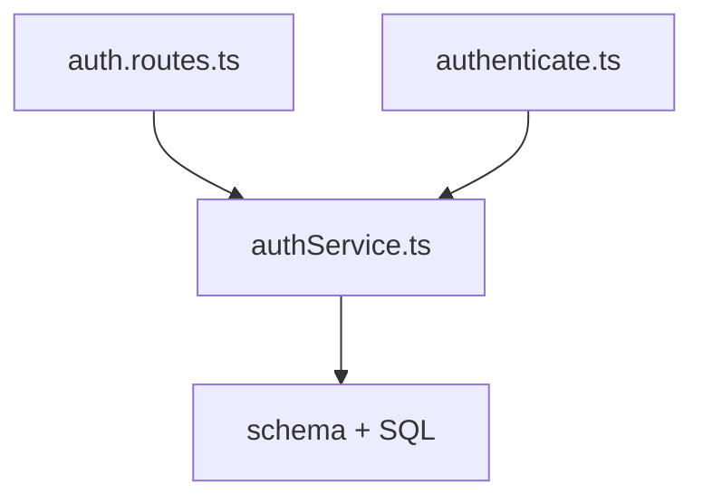

# Auth Foundation — справочник

> Читай **один раз** при старте auth-трека v2.2. Рабочий план — [CURRENT_INCREMENT.md](../CURRENT_INCREMENT.md); полная спека релиза — [CURRENT_RELEASE.md](../CURRENT_RELEASE.md) (#1–#6, типы, Практика).
> Long-term overview — [ROADMAP.md](../ROADMAP.md). Архив mega: [_archive/MEGA_AUTH_v1.md](./_archive/MEGA_AUTH_v1.md).

**Релиз:** [CURRENT_RELEASE.md](../CURRENT_RELEASE.md) — v2.2 Персонализация
> **Managed auth (US 2.2.13):** [MANAGED_AUTH_ADR.md](./MANAGED_AUTH_ADR.md) — инкремент #6, Decision TBD до 6a. Issue: #74
> **UI login/register:** отдельные страницы — см. [Research § UI-оболочка](#client-ui-оболочка-loginregister).

**Покрывает US:** 2.2.1, 2.2.4, 2.2.5, 2.2.6, 2.2.13 *(2.2.10 optional custom)*
**Покрывает вопросы:** Q2, Q3, Q6–Q8, Q25–Q32, Q45, Q50, Q74, FQ3, FQ25, FQ34, FQ37–FQ39, FQ56–FQ58, FQ61–FQ63, FQ66–FQ68

---

## На пальцах

Бытовые аналогии **до** кода. Единый домен — **аэропорт**. Полный glossary: [ANALOGY_GUIDE.md](../guides/ANALOGY_GUIDE.md).

### Зачем два документа (сначала проблема, потом хранение)

| Проблема | Что было бы | Решение |
| -------- | ----------- | ------- |
| Один талон на год | Украли — летаешь чужим именем долго | Короткий **boarding pass** (~15 мин) |
| Талон на 15 мин без «запомнить» | Каждые 15 мин заново check-in с паспортом | Долгий **профиль в системе авиакомпании** (7 дней) |
| Компромисс | — | Короткий pass + профиль для **тихого** перевыпуска talon |

> **Где ломается аналогия:** в жизни часто один boarding pass на весь рейс; в JWT два документа **специально** для безопасности.

### Глоссарий

| Термин | В аэропорту | В коде |
| ------ | ----------- | ------ |
| **Identification** | Имя/email при бронировании | поле email |
| **Authentication** | Check-in: паспорт проверен | `POST /login`, bcrypt |
| **Authorization** | У gate / в VIP-зал без талона — нельзя | middleware, `ProtectedRoute` |
| **Access token** | Посадочный талон (~15 мин) | `tokenMemory`, Bearer |
| **Refresh token** | Профиль в системе авиакомпании | httpOnly cookie |
| **JWT** | Штрихкод на талоне | jwt.verify |
| **Context** | Экран: «Добро пожаловать, Ivan» | `AuthProvider` |
| **tokenMemory** | Талон на экране приложения (RAM) | `getAccessToken()` |
| **apiFetch** | Единая процедура у каждого gate | `shared/api/apiFetch.ts` |
| **Interceptor** | «Талон?» → kiosk refresh → retry | 401 → `/refresh` |
| **TanStack Query** | Табло рейсов (не талон) | `newsQueries` |
| **ProtectedRoute** | Gate в VIP-зал (избранное) | `/favorites`, redirect |
| **localStorage** | Номер талона на лбу маркером | не используем (XSS) |

### Два токена — где лежат

| | Access token | Refresh token |
| --- | --- | --- |
| **В аэропорту** | Boarding pass в руке / на экране | Профиль «запомнить меня» в системе |
| **Срок** | ~15 мин | ~7 дней |
| **Где** | `tokenMemory` (RAM) | httpOnly cookie |
| **Зачем** | Часто в запросах — короткий TTL | JS не читает — сложнее украсть |

### Компоненты (один узел = одна идея)

| Компонент | В аэропорту | Когда в timeline |
| --------- | ----------- | ---------------- |
| LoginForm | Бланк check-in | Check-in |
| Header | Вывеска + «Ivan» | После login |
| ProtectedRoute | Gate в VIP-зал (избранное) | Route `/favorites` |

### Timeline — один день пассажира



**apiFetch + interceptor — одна сцена:** каждый gate-запрос через **GateAgent (apiFetch)**: показать boarding pass → 401 → **Kiosk (/refresh)** → новый pass → retry.

**Подробный разбор токенов (из чата, FAQ, карта хранения):** [TOKENS_AND_JWT.md](../guides/TOKENS_AND_JWT.md).

---

## Research: сравнение подходов

**Критерии (вес):** Fit 30%, Industry 20%, Portfolio 20%, Learning 15%, Cost 15%.

### Client: где хранить auth-состояние

| # | Подход | Плюсы | Минусы | В аэропорту | Σ | Вердикт |
| - | ------ | ----- | ------ | ----------- | - | ------- |
| 1 | **Context + tokenMemory + apiFetch** | React docs: useState для app; KISS; apiFetch вне React | Два места — нужно объяснить | Талон на экране + профиль в системе + процедура gate | **8.4** | **✅ Выбрано** |
| 2 | **Zustand** | Популярен; один store | Лишняя dep для auth | Отдельное приложение-кошелёк для talon | 7.6 | ⚠️ overkill |
| 3 | **Context-only (token в useState)** | Один источник | apiFetch без useContext; token в queryKey → refetch ([#5894](https://github.com/TanStack/query/issues/5894)) | Талон только на табло — gate не видит | 6.8 | ❌ |
| 4 | **useSyncExternalStore + store** | Корректно для external store | Редко в app; React: *use useState instead* | Своя система учёта talon с нуля | 6.2 | ❌ |
| 5 | **Token в TanStack Query cache** | «Всё в одном» | Stale closure; token ≠ server data | Табло хранит talon — путаем роли | 5.5 | ❌ |
| 6 | **Redux / RTK** | Enterprise | Удалён (#41) | Целый terminal для одного talon | 4.8 | ❌ |
| 7 | **Token в localStorage** | Переживает F5 | XSS | Маркер на лбу | 4.5 | ❌ |

### Server: сессия

| # | Подход | Σ | Вердикт |
| - | ------ | - | ------- |
| 1 | **JWT access + refresh rotation + httpOnly cookie** | 8.6 | **✅ Выбрано** |
| 2 | Session ID в cookie only | 7.0 | ⚠️ избыточно для v2.2 |
| 3 | Token только в localStorage | 4.0 | ❌ |

### Forms

| # | Подход | Σ | Вердикт |
| - | ------ | - | ------- |
| 1 | **RHF + Zod** | 8.2 | **✅** US 2.2.4 |
| 2 | useState (FeedbackForm) | 6.0 | ❌ |

### Client: UI-оболочка login/register

**Дата решения:** 2026-06-09  
**Статус:** accepted  
**Связь со спекой:** US 2.2.4 (`LoginPage`, `RegisterPage`, роуты); US 2.2.5 (`redirect /login`, `state.from`).

**Критерии (вес):** Fit со спекой 25%, Простота 25%, UX 20%, Deep link / refresh 15%, Безопасность 15%.

| # | Подход | UX | Простота | Спека #4–#5 | Deep link | Безопасность | Σ | Вердикт |
| - | ------ | -- | -------- | ----------- | --------- | ------------ | - | ------- |
| 1 | **Отдельные страницы** `/login`, `/register` | 7 | **9** | **10** | **10** | **10** | **8.8** | **✅ Выбрано** |
| 2 | Модалка, URL не меняется | **9** | **9** | 4 | 2 | **10** | 7.4 | ❌ ломает redirect #5 |
| 3 | Query `?auth=login` на текущей странице | **9** | 8 | 7 | 6 | 9 | 7.8 | ⚠️ переписать AC |
| 4 | Гибрид `/login` + `state.background` + Modal | **9** | 4 | 8 | 9 | **10** | 7.2 | ⚠️ overkill для US |
| 5 | Одна страница `/auth` (табы) | 7 | 8 | 8 | 8 | **10** | 7.6 | ⚠️ |
| 6 | Черновик в URL (`?email=…`) | 5 | 6 | — | 4 | 3 | 4.0 | ❌ пароль в URL — никогда |

**Почему #1:**

1. Совпадает с AC US 2.2.4 и redirect US 2.2.5 без переделки docs.
2. Один `<Outlet />` — без второго слоя рендера и `state.background`.
3. `/login` — deep link, предсказуемый refresh (форма заново; пароль не персистим).
4. Ядро US не меняется: `LoginForm` / `RegisterForm` / RHF / Zod — оболочка только `*Page`.

**Trade-off:** гость уходит с каталога/статьи на отдельный экран (хуже UX, чем модалка). Mantine Modal / Portal — вне scope US 2.2.4.

**Отклонено явно:** пароль (и вообще секреты) в URL; email в URL — спорно, при необходимости черновика → `sessionStorage`, не query.

### Frontend architecture (без аналогий)

| # | Подход | Σ | Вердикт |
| - | ------ | - | ------- |
| 1 | **Module Map lite** (core / auth / catalog / engagement) | 8.5 | **✅** см. [MODULE_MAP.md](../../architecture/MODULE_MAP.md) |
| 2 | Colocation в `pages/` | 8.0 | ✅ правило по умолчанию |
| 3 | Flat FSD (features/* для всего) | 6.5 | ❌ boilerplate |
| 4 | **Unified `components/` + arch:lint** | — | **✅** commit ab66f61 |

**Итог Research:** **Context (UI) + tokenMemory (HTTP) + apiFetch (interceptor) + JWT/httpOnly** — #1 client auth; **Module Map lite** — #1 architecture; **UI login/register:** отдельные страницы `/login`, `/register` — #1 UI-оболочка. См. [ADR-001](../../architecture/ADR-001-frontend-module-map.md).

---

## Концепция

```
Регистрация:
  POST /api/auth/register { email, password }
  → bcrypt.hash(password, 12)
  → INSERT INTO users
  → { accessToken } + Set-Cookie: refreshToken (httpOnly)

Логин:
  POST /api/auth/login { email, password }
  → find user → bcrypt.compare
  → accessToken (15m) в body + refreshToken (7d) в cookie

Bootstrap (F5 / первый заход):
  AuthProvider → POST /api/auth/refresh (cookie auto)
  → 200: setAccessToken + setUser
  → 401: гость, ок

Запрос к API:
  apiFetch → Authorization: Bearer + credentials: include
  → 401 → POST /refresh → retry

Logout:
  POST /api/auth/logout
  → удалить refresh из БД + clear cookie + clearAccessToken + setUser(null)
```

**Перевод на код:** см. timeline в «На пальцах» + [ANALOGY_GUIDE.md](../guides/ANALOGY_GUIDE.md).

**Почему access в памяти, refresh в httpOnly cookie:** localStorage доступен любому JS (XSS). httpOnly cookie — нет. Короткий access ограничивает ущерб при утечке.

---

## Решения и паттерны

| Решение | KISS / DRY / SOLID | Почему не альтернатива |
| ------- | ------------------ | ---------------------- |
| **Context + tokenMemory** | SRP: UI vs HTTP; KISS | [useSyncExternalStore](https://react.dev/reference/react/useSyncExternalStore) — для lib authors; Context-only — apiFetch без React |
| **AuthProvider (useState)** | FQ34 Context API | Redux/Zustand — overkill |
| **shared/api/apiFetch.ts** | DRY | Inline fetch в `newsQueries.ts` |
| **Refresh httpOnly cookie** | Security | localStorage refresh |
| **Access 15m in memory** | Minimize XSS | localStorage |
| **Zod shared schemas** | DRY | Drift front/back |
| **RHF + zodResolver** | US 2.2.4 | useState forms |
| **useLayoutEffect bootstrap** | No FOUC (FQ25) | useEffect flash |
| **TanStack Query = server data only** | Separation | Auth in query cache ([#5894](https://github.com/TanStack/query/issues/5894)) |

---

## Git

**Ветка:** `v2.2.0-auth`
**Issue:** TBD

---

## Архитектура

> Module Map lite — без аналогий. Living doc: [MODULE_MAP.md](../../architecture/MODULE_MAP.md), решение: [ADR-001](../../architecture/ADR-001-frontend-module-map.md).
>
> **Прогресс по фазам** — на мастер-схемах **D** (backend) и **A** (frontend modules). Диаграммы B/C/F — справочные разрезы; см. [Карта фаз → диаграммы](#карта-фаз--диаграммы).

### A — Module Map (C4-lite)



### B — Sequence: login + 401 refresh (аэропорт)



### C — Context vs tokenMemory vs apiFetch



### D — Backend SOLID



### F — Где хранить что (security)

| Хранилище | Что | Почему |
| --------- | --- | ------ |
| **tokenMemory (JS variable)** | Access token | Не переживает XSS через localStorage; короткий TTL |
| **httpOnly cookie** | Refresh token | JS не читает |
| **Context (useState)** | user, isLoading | UI-состояние |
| **TanStack Query cache** | news, favorites | Server state, не auth |
| **localStorage** | theme, mockMode | OK для некритичного |

### Дерево файлов (Module Map lite)

```
server/src/
├── app.ts                     ← ИЗМЕНИТЬ: CORS credentials, cookie-parser, auth routes
├── db/
│   └── schema.ts              ← ИЗМЕНИТЬ: users, refresh_tokens
├── routes/
│   └── auth.routes.ts         ← НОВЫЙ
├── services/
│   ├── authService.ts         ← НОВЫЙ
│   └── oauthService.ts        ← НОВЫЙ (фаза 7)
└── middleware/
    └── authenticate.ts        ← НОВЫЙ

client/src/
├── shared/api/
│   ├── apiFetch.ts            ← НОВЫЙ (→ core/http/ при рефакторе)
│   ├── queryClient.ts         ✅ уже есть
│   └── authSchemas.ts         ← НОВЫЙ (Zod)
├── model/news/api/tanstack/
│   └── newsQueries.ts         ← ИЗМЕНИТЬ: import apiFetch
├── pages/Main/
│   ├── lib/useNewsFilterParams.ts
│   └── components/            ← SearchInput, NewsFeed, NewsFeedView, …
├── pages/NewsDetail/
│   └── components/            ← NewsDetailView, ReadersCount (+ useLiveReaders)
├── pages/Auth/
│   ├── lib/tokenMemory.ts     ← НОВЫЙ
│   ├── LoginForm.tsx          ← НОВЫЙ
│   ├── RegisterForm.tsx       ← НОВЫЙ
│   ├── GoogleButton.tsx       ← НОВЫЙ (фаза 7)
│   ├── LoginPage.tsx          ← НОВЫЙ
│   └── RegisterPage.tsx       ← НОВЫЙ
├── app/
│   ├── providers/AuthProvider.tsx  ← НОВЫЙ
│   ├── router/ProtectedRoute.tsx   ← НОВЫЙ
│   └── router.tsx             ← ИЗМЕНИТЬ
└── pages/Auth/lib/useAuth.ts  ← НОВЫЙ (или рядом с AuthProvider)
```

**Colocation rule:** extract to `features/` only when used from 2+ places. Auth colocated в `pages/Auth/`; HTTP в `shared/api/` (alias `core/http/`).

---

---

## Git

**Ветка:** `v2.2.0-auth`
**Issue:** TBD


---

## Карта legacy-фаз → US (из mega v1)

| Фаза | Мастер-схема | Узлы «сейчас» | После фазы работает | Сцена timeline B |
| ---- | ------------ | ------------- | ------------------- | ---------------- |
| 1 | **D** Backend | `schema`, `authService`, `auth.routes` | curl: register → login → refresh → logout | → **US 2.2.1 Backend** |
| 2 | **D** Backend | `authenticate` middleware | curl: Bearer на protected route | → **US 2.2.1 Client** |
| 3 | **A** + §C | `tokenMemory`, `apiFetch`, `AuthProvider` | F5 → auto login по cookie; news через apiFetch | → **US 2.2.1 Client** |
| 4 | **A** | `LoginForm`, `RegisterForm`, `authSchemas` | UI login/register | → **US 2.2.4** |
| 5 | **A** | `ProtectedRoute`, `router` | redirect на `/login`; post-login `state.from` | → **US 2.2.5** |
| 6 | **A** + §C/§F | изменения в `apiFetch`, `AuthProvider` | logout прерывает in-flight запросы | → **US 2.2.6** |
| 7 | **D** + **A** | Managed provider (Clerk/Auth0) | Google + verify/reset через dashboard | → **US 2.2.13** |
| ФИНАЛ | A + D | все узлы | AC mega-инкремента | полный timeline B |


---

## Подводные камни (cross-cutting)

- **CORS `credentials: true`** + client `credentials: 'include'` — оба нужны для cookie
- **Rate-limit** на auth — brute-force
- **Refresh rotation** — старый RT invalid после `/refresh`
- **OAuth + password** — `password_hash` nullable
- **Logout = POST** — не GET (Q45: данные не в URL)

---

---

## Самопроверка: вопросы инкремента

> Ответ = своими словами + где в коде. Эталоны — под спойлером.

### Уровень 1 — Концепции

> **В чём разница между идентификацией, аутентификацией и авторизацией?**

| | Identification | Authentication | Authorization |
| --- | --- | --- | --- |
| **Суть** | «Кто вы *заявляете*, что вы?» | «Докажите, что это вы» | «Что вам *можно*?» |
| **Happy News** | Поле email | POST /login, bcrypt, JWT | middleware, ProtectedRoute |
| **В аэропорту** | Имя при бронировании | Check-in с паспортом | Gate в VIP-зал |
| **Порядок** | 1 | 2 | 3 |

<details>
<summary>Эталонный ответ</summary>

Идентификация — заявить identity (email). Аутентификация — check-in: проверить secret (пароль/OAuth) и выдать boarding pass. Авторизация — gate решает, пустить ли в VIP-зал (избранное). Порядок: identify → authenticate → authorize.

</details>

| # | Вопрос | В аэропорту | Где в коде | RELEASE |
| --- | ------ | ----------- | ---------- | ------- |
| 1.1 | Чем login отличается от register? | Первый check-in vs новая регистрация в системе | `authService.ts` | Q2 |
| 1.2 | Гость vs user — auth или authz? | Нет talon vs есть talon — gate решает | `ProtectedRoute.tsx` | Q3 |
| 1.3 | OAuth Google — authentication? | Check-in через партнёра (Google) | `oauthService.ts` | Q2 |

<details>
<summary>1.1 — эталон</summary>

Register создаёт аккаунт + выдаёт tokens. Login проверяет существующий аккаунт. Оба — authentication после identification по email.

</details>

<details>
<summary>1.2 — эталон</summary>

Authorization: гость без talon не пройдёт gate в `/favorites`; ProtectedRoute решает доступ. Authentication уже произошла (или нет) — есть ли валидная сессия.

</details>

<details>
<summary>1.3 — эталон</summary>

Authentication: Google доказывает личность. Authorization — те же ProtectedRoute/middleware после выдачи JWT.

</details>

### Уровень 2 — Токены и сессия

> Эталоны ниже — кратко. Развёрнуто: [TOKENS_AND_JWT.md](../guides/TOKENS_AND_JWT.md) (§3–§13).

| # | Вопрос | В аэропорту | Где в коде | RELEASE |
| --- | ------ | ----------- | ---------- | ------- |
| 2.1 | Зачем два token? | Короткий pass + долгий профиль | «На пальцах» | Q27, Q28 |
| 2.2 | Access в памяти, refresh в cookie? | Pass на экране vs профиль в системе | `tokenMemory`, Set-Cookie | Q29, Q30 |
| 2.3 | JWT: header, payload, signature? | Штрихкод на talon | `authService` jwt.sign | Q26 |
| 2.4 | Refresh rotation? | Старый профиль-сессия аннулируется | `authService.refresh` | Q74 |
| 2.5 | F5 — остаётесь залогинены? | Kiosk выдаёт новый pass по cookie | `AuthProvider` bootstrap | — |
| 2.6 | Token не в TanStack cache? | Табло ≠ talon | Research, `apiFetch` | FQ38 |

<details>
<summary>2.1 — эталон</summary>

Access короткий — меньше ущерб при XSS (украли pass с экрана). Refresh в httpOnly — JS не читает. Kiosk (/refresh) выдаёт новый pass без повторного check-in с паролем.

→ [TOKENS_AND_JWT §3, §13](../guides/TOKENS_AND_JWT.md#3-сначала-проблема-потом-хранение)

</details>

<details>
<summary>2.2 — эталон</summary>

Access часто уходит в Authorization — в памяти, не localStorage. Refresh только для `/refresh` — httpOnly cookie, браузер шлёт сам с credentials.

→ [TOKENS_AND_JWT §7–§8](../guides/TOKENS_AND_JWT.md#7-ram--это-не-localstorage)

</details>

<details>
<summary>2.3 — эталон</summary>

Header: alg. Payload: sub, email, exp. Signature: HMAC секретом сервера. Verify проверяет подпись и exp.

→ [TOKENS_AND_JWT §5](../guides/TOKENS_AND_JWT.md#5-access-token--jwt)

</details>

<details>
<summary>2.4 — эталон</summary>

Каждый /refresh выдаёт новый RT, старый удаляется из БД. Украденный старый RT не работает — detect reuse.

→ [TOKENS_AND_JWT §10–§11](../guides/TOKENS_AND_JWT.md#10-операции)

</details>

<details>
<summary>2.5 — эталон</summary>

Да, если refresh cookie жива: AuthProvider при mount → POST /refresh → setAccessToken + setUser. Access в памяти пуст после F5 — восстанавливается через refresh.

→ [TOKENS_AND_JWT §9](../guides/TOKENS_AND_JWT.md#9-связь-access-и-refresh)

</details>

<details>
<summary>2.6 — эталон</summary>

Token — не server data. В cache → stale closure, лишние refetch при смене token. TkDodo: auth в HTTP layer.

→ [TOKENS_AND_JWT §12](../guides/TOKENS_AND_JWT.md#12-маппинг-на-файлы-us-221)

</details>

### Уровень 3 — Архитектура

| # | Вопрос | Где в коде | RELEASE |
| --- | ------ | ---------- | ------- |
| 3.1 | Зачем Context и tokenMemory? | Экран «Ivan» vs talon для gate | Диаграмма C | FQ37, FQ39 |
| 3.2 | apiFetch в shared, не pages/Auth? | Одна процедура gate для всех | Module Map | FQ3 |
| 3.3 | Граница core / auth / catalog? | Разные зоны аэропорта | Диаграмма A | — |
| 3.4 | Почему не Redux/Zustand? | Research | FQ40 |
| 3.5 | TanStack Query vs auth? | newsQueries + apiFetch | FQ38 |

<details>
<summary>3.1 — эталон</summary>

Context — экран «Welcome Ivan» (user, isLoading). tokenMemory — boarding pass для apiFetch вне React. UI не читает token.

</details>

<details>
<summary>3.2 — эталон</summary>

newsQueries, favorites, auth — все через один apiFetch (gate). core/shared = переиспользуемый HTTP без бизнес-логики forms.

</details>

<details>
<summary>3.3 — эталон</summary>

core: apiFetch, schemas. auth: pages/Auth, AuthProvider, tokenMemory. app: ProtectedRoute, router wiring.

</details>

<details>
<summary>3.4 — эталон</summary>

Auth state простой (user + token). RTK удалён. Zustand — лишняя dep. Context+module — KISS.

</details>

<details>
<summary>3.5 — эталон</summary>

TanStack: кеш server data (news). Auth session: Context + tokenMemory + cookie. Не смешивать.

</details>

### Уровень 4 — Backend

| # | Вопрос | Где в коде | RELEASE |
| --- | ------ | ---------- | ------- |
| 4.1 | bcrypt cost 12? | authService | Q50 |
| 4.2 | Одинаковый ответ при неверном email/пароле? | login | — |
| 4.3 | authenticate middleware? | authenticate.ts | Q31, Q32 |
| 4.4 | rate-limit на /auth? | auth.routes | — |
| 4.5 | foreign_keys ON? | schema.ts | — |
| 4.6 | Register 409? | auth.routes | — |

<details>
<summary>4.1 — эталон</summary>

bcrypt + salt, медленный hash — brute-force дороже. cost 12 — баланс security/CPU.

</details>

<details>
<summary>4.2 — эталон</summary>

Anti-enumeration: атакующий не узнает, существует email. Всегда 401 «Invalid credentials», bcrypt.compare даже для fake hash.

</details>

<details>
<summary>4.3 — эталон</summary>

Читает Bearer, jwt.verify, кладёт req.user, next(). Иначе 401. Для `/favorites` и т.д.

</details>

<details>
<summary>4.4 — эталон</summary>

Защита login/register от brute-force перебора паролей.

</details>

<details>
<summary>4.5 — эталон</summary>

SQLite без FK по умолчанию — orphan refresh_tokens. PRAGMA включает REFERENCES.

</details>

<details>
<summary>4.6 — эталон</summary>

409 Conflict — ресурс (email) уже существует. 400 — невалидный body.

</details>

### Уровень 5 — Frontend

| # | Вопрос | Где в коде | RELEASE |
| --- | ------ | ---------- | ------- |
| 5.1 | useLayoutEffect vs useEffect? | AuthProvider | FQ25 |
| 5.2 | Redirect после login? | ProtectedRoute, navigate(from) | FQ63 |
| 5.3 | Interceptor при 401? | apiFetch | Q74 |
| 5.4 | RHF + Zod при 2 полях? | LoginForm | FQ66, FQ67 |
| 5.5 | native form + autocomplete? | LoginForm | — |
| 5.6 | React.lazy Auth? | router | FQ62 |

<details>
<summary>5.1 — эталон</summary>

useLayoutEffect до paint — нет мигания «гость» перед refresh. useEffect — flash FOUC.

</details>

<details>
<summary>5.2 — эталон</summary>

ProtectedRoute сохраняет location в Navigate state. LoginPage после успеха: navigate(from.pathname ?? '/').

</details>

<details>
<summary>5.3 — эталон</summary>

401 → single-flight POST /refresh → setAccessToken → retry original. Refresh 401 → clear + login.

</details>

<details>
<summary>5.4 — эталон</summary>

US учит RHF+Zod, shared validation с backend, setError для server errors, меньше re-renders.

</details>

<details>
<summary>5.5 — эталон</summary>

Password managers требуют form + autocomplete. current-password vs new-password.

</details>

<details>
<summary>5.6 — эталон</summary>

Auth chunk (RHF+Zod) не грузится гостям на главной — меньше bundle.

</details>

### Уровень 6 — Безопасность

| # | Вопрос | Где в коде | RELEASE |
| --- | ------ | ---------- | ------- |
| 6.1 | XSS и token? | Research | FQ68, Q30 |
| 6.2 | SameSite=Strict? | cookie options | Q7 |
| 6.3 | Logout во время запроса? | apiFetch, фаза 6 | FQ57, FQ58 |
| 6.4 | credentials + CORS? | apiFetch, app.ts | Q6 |

<details>
<summary>6.1 — эталон</summary>

XSS выполняет JS → читает localStorage. Access в memory + refresh httpOnly — JS не достаёт refresh.

</details>

<details>
<summary>6.2 — эталон</summary>

Cookie не отправляется с cross-site POST — CSRF на refresh сложнее.

</details>

<details>
<summary>6.3 — эталон</summary>

isLoggingOut + AbortController — старый запрос не retry после logout, token cleared.

</details>

<details>
<summary>6.4 — эталон</summary>

Browser шлёт cookie только с credentials:include. Server cors credentials:true + explicit origin (не *).

</details>

### Уровень 7 — OAuth

| # | Вопрос | Где в коде | RELEASE |
| --- | ------ | ---------- | ------- |
| 7.1 | OAuth vs password — общее? | oauthService, authService | Q2 |
| 7.2 | password_hash nullable? | schema | — |
| 7.3 | Callback URL mismatch? | .env, Google Console | — |

<details>
<summary>7.1 — эталон</summary>

OAuth идентифицирует через Google, но выдаём **свои** access+refresh — та же token-инфраструктура.

</details>

<details>
<summary>7.2 — эталон</summary>

Google-user не имеет пароля. Email-login для такого user → 401 «use Google».

</details>

<details>
<summary>7.3 — эталон</summary>

Google отклонит redirect — OAuth flow сломается. http/https, port, path — exact match.

</details>

### Уровень 8 — Мелочи

| # | Вопрос | Где в коде |
| --- | ------ | ---------- |
| 8.1 | current-password vs new-password? | LoginForm / RegisterForm |
| 8.2 | Bearer куда в HTTP? | `Authorization: Bearer <token>` |
| 8.3 | Logout POST, не GET? | auth.routes (Q45) |
| 8.4 | MSW handlers /api/auth/*? | handlers.ts — тесты без server |
| 8.5 | gen:openapi:sync? | типы client из OpenAPI |

<details>
<summary>8.1 — эталон</summary>

Login: current-password (заполнить сохранённый). Register: new-password (предложить сохранить новый).

</details>

<details>
<summary>8.2 — эталон</summary>

Request header Authorization. apiFetch добавляет перед fetch.

</details>

<details>
<summary>8.3 — эталон</summary>

GET может попасть в логи, prefetch, CSRF. POST + side effects — logout изменяет state.

</details>

<details>
<summary>8.4 — эталон</summary>

Vitest + MSW: LoginForm, apiFetch тестируются изолированно. onUnhandledRequest: error ловит забытые URLs.

</details>

<details>
<summary>8.5 — эталон</summary>

auth routes в OpenAPI → `openapi.d.ts` → типизированные client payloads.

</details>

