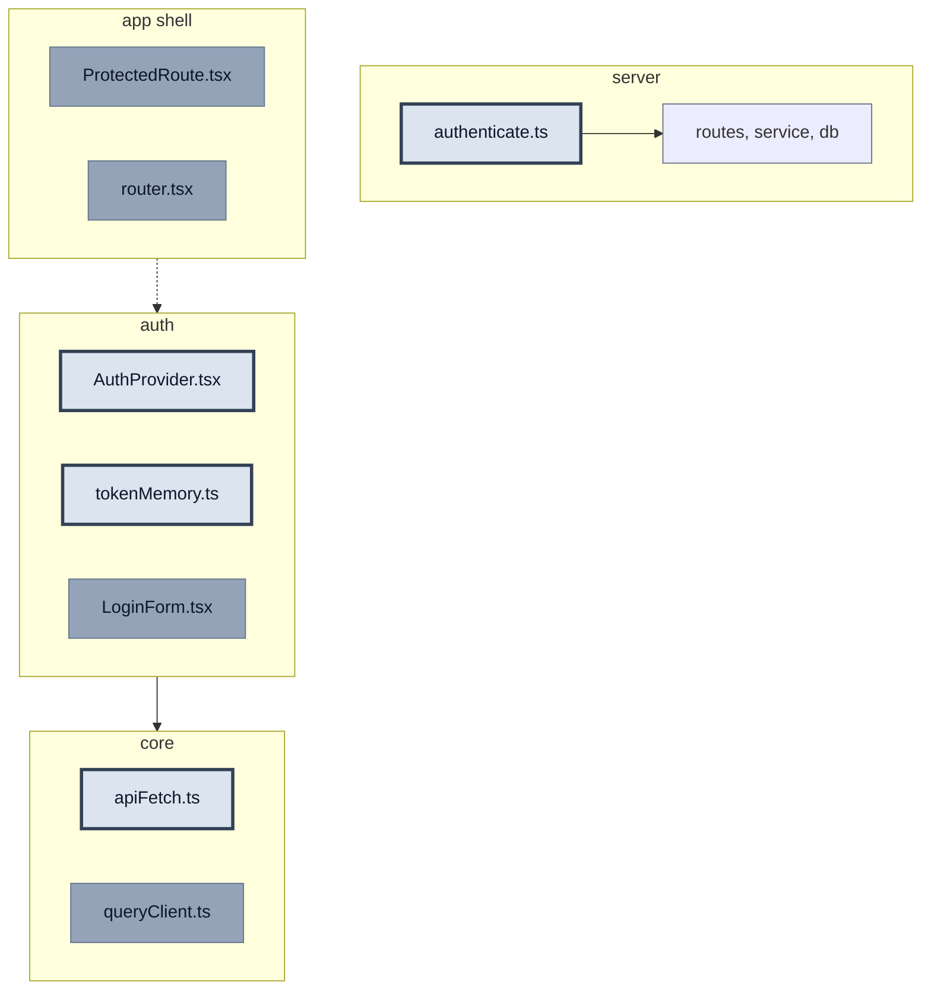

# US 2.2.1 — Client Session

**Статус:** `pending`  
**Релиз:** [CURRENT_RELEASE.md](../../CURRENT_RELEASE.md)  
**Справочник:** [AUTH_REFERENCE.md](../AUTH_REFERENCE.md) — §C  
**Practice:** [PRACTICE_MODE.md](../../guides/PRACTICE_MODE.md)  
**Issue:** TBD — `npm run _ create-task "US 2.2.1: Client Session"`  
**Предусловие:** US 2.2.1 Backend ✅

**Acceptance Criteria:**

- [ ] `authenticate` middleware — Bearer JWT → `req.user`
- [ ] Access token в `tokenMemory` (RAM)
- [ ] F5 → bootstrap через `POST /api/auth/refresh`
- [ ] `apiFetch`: credentials, Bearer, 401 → refresh → retry
- [ ] `newsQueries.ts` → `apiFetch`

---

## На схеме

**Мастер-схема:** A + §C ([AUTH_REFERENCE](../AUTH_REFERENCE.md))

**В этом US:**

| Файл | Действие |
| ---- | -------- |
| `authenticate.ts` | новый |
| `apiFetch.ts` | изменить |
| `AuthProvider.tsx` | новый |
| `tokenMemory.ts` | новый |

**Не в этом US:** `LoginForm.tsx`, `ProtectedRoute.tsx`, `router.tsx`, `queryClient.ts`

**После US:** F5 → auto-login; GET `/api/news` через apiFetch с Bearer  
**Сцена timeline:** «Есть cookie?» → POST /refresh; GET /news → 401 → /refresh → retry  
**Полная карта:** [AUTH_REFERENCE §C](../AUTH_REFERENCE.md)

| Статус | Фон | Обводка | Текст |
| ------ | --- | ------- | ----- |
| done | нет (default) | тонкая `#64748b` | default |
| **active (WIP)** | `#dce4ef` | жирная `#334155` | `#0f172a` |
| later | `#94a3b8` | тонкая `#64748b` | `#0f172a` |



---

## Зачем этот US

Server умеет выдавать tokens (#1). Здесь client **хранит access в RAM**, **bootstrap по cookie** после F5 и **единый apiFetch** с interceptor — чтобы catalog (news) и позже engagement ходили через один gate.

---

## Git

**Ветка:** `v2.2.0-auth`  
**Issue:** TBD — `npm run _ create-task "US 2.2.1: Client Session"`

---

## Практика

### `server/src/middleware/authenticate.ts` (НОВЫЙ)

```typescript
export function authenticate(req, res, next) {
  // Шаг 1: Authorization: Bearer <token>
  // Шаг 2: jwt.verify → req.user = { id, email }
  // Шаг 3: valid → next(); иначе 401
}
```

**Подводный камень:** не вешать на `/api/auth/login`, `/register`.

---

### `client/src/pages/Auth/lib/tokenMemory.ts` (НОВЫЙ)

```typescript
// module-level variable — без subscribe

export function getAccessToken() {
  // вернуть текущий access или null
}

export function setAccessToken(token: string) {
  // записать в module variable
}

export function clearAccessToken() {
  // null
}
```

---

### `client/src/pages/Auth/lib/useAuth.ts` (НОВЫЙ)

```typescript
export function useAuth() {
  // return useContext(AuthContext)
}
```

---

### `client/src/shared/api/apiFetch.ts` (НОВЫЙ)

```typescript
export async function apiFetch(input, init?) {
  // Шаг 1: credentials: 'include'
  // Шаг 2: Authorization: Bearer getAccessToken()
  // Шаг 3: fetch → если 401: single-flight POST /api/auth/refresh
  // Шаг 4: setAccessToken → retry original once
  // Шаг 5: refresh fail → clearAccessToken → throw
}
```

---

### `client/src/app/providers/AuthProvider.tsx` (НОВЫЙ)

```typescript
export function AuthProvider({ children }) {
  // useState: user, isLoading

  // useLayoutEffect (не useEffect!):
  //   POST /api/auth/refresh
  //   200 → setAccessToken + setUser
  //   401 → isLoading=false, user=null

  // login / logout methods для следующих US

  // render: AuthContext.Provider
}
```

---

### `client/src/app/main.tsx` — ИЗМЕНИТЬ

```typescript
// ====== ИЗМЕНЁННЫЙ БЛОК US 2.2.1 Client ======
// обернуть дерево в <AuthProvider>
```

---

### `client/src/model/news/api/tanstack/newsQueries.ts` — ИЗМЕНИТЬ

```typescript
// ====== ИЗМЕНЁННЫЙ БЛОК ======
// заменить inline fetch на apiFetch
```

---

## Проверка и тесты

### Ручная (обязательно)

| # | Input | Output |
| - | ----- | ------ |
| 1 | Login через curl → открыть app с cookie | F5 → user восстановлен, не «гость» |
| 2 | GET `/api/news` в Network | Request с `Authorization: Bearer` |
| 3 | curl protected route + Bearer | 200; без Bearer → 401 |

- [ ] F5 bootstrap
- [ ] news через apiFetch с Bearer
- [ ] authenticate middleware на test protected route

### Автотесты (обязательно)

- [ ] `client/src/pages/Auth/lib/tokenMemory.test.ts`

```typescript
describe('tokenMemory', () => {
  it('set/get/clear access token', () => {
    // setAccessToken('x') → getAccessToken() === 'x'
    // clearAccessToken() → null
  })
})
```

- [ ] `client/src/shared/api/apiFetch.test.ts` — MSW: 401 → refresh → retry

```typescript
describe('apiFetch', () => {
  it('retries after refresh on 401', () => {
    // MSW: first GET /api/news → 401; POST /refresh → 200 + token; retry → 200
  })
})
```

- [ ] `client/src/app/providers/AuthProvider.test.tsx` — bootstrap 200/401

- [ ] MSW handlers `/api/auth/*` в `handlers.ts`

```bash
pnpm --filter react-happy-news-client exec vitest run src/pages/Auth/lib/tokenMemory.test.ts
pnpm --filter react-happy-news-client exec vitest run src/shared/api/apiFetch.test.ts
pnpm --filter react-happy-news-client exec vitest run src/app/providers/AuthProvider.test.tsx
```

---

## Запуск

```bash
pnpm dev:server   # терминал 1
pnpm dev:client   # терминал 2
# login через curl или временный fetch в console → F5
pnpm --filter react-happy-news-client exec vitest run src/pages/Auth/lib/tokenMemory.test.ts
```

```bash
git add server/src/middleware/ client/src/pages/Auth/ client/src/app/providers/ client/src/shared/api/ client/src/model/news/api/tanstack/ client/src/app/mocks/
git commit -m "feat: #N tokenMemory + AuthProvider + apiFetch + authenticate"
```

---

## Самопроверка US

1. Зачем Context **и** tokenMemory? → [AUTH_REFERENCE §C](../AUTH_REFERENCE.md)
2. Почему `useLayoutEffect`? → нет FOUC «гость»
3. apiFetch при 401? → single-flight refresh + retry

## Следующий US

[US-2.2.4-forms.md](./US-2.2.4-forms.md)
