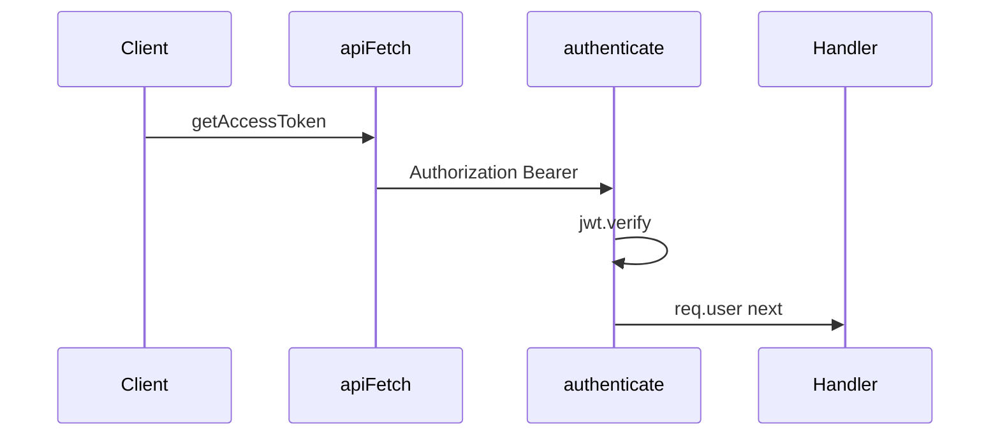
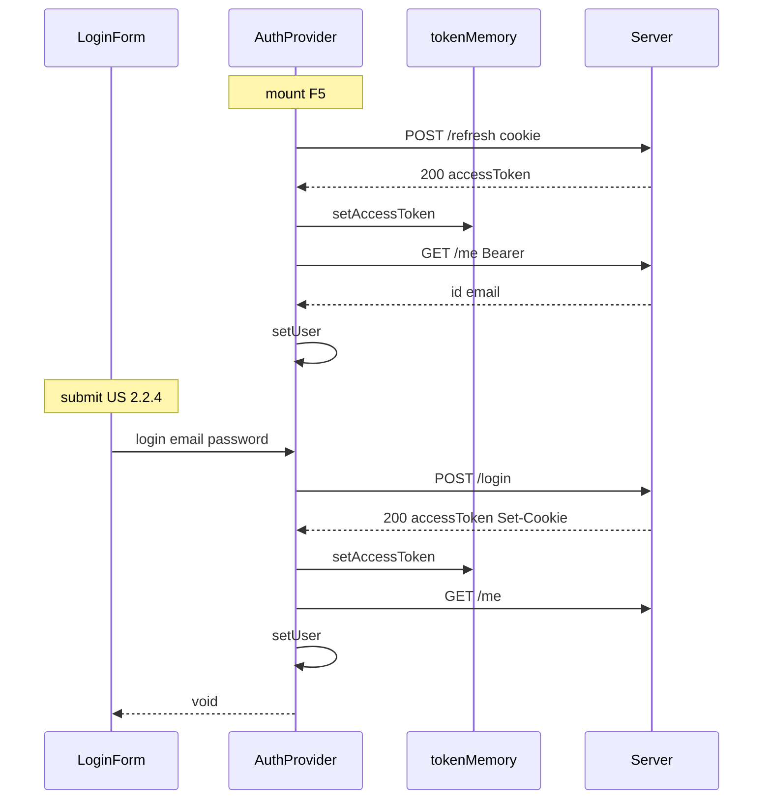
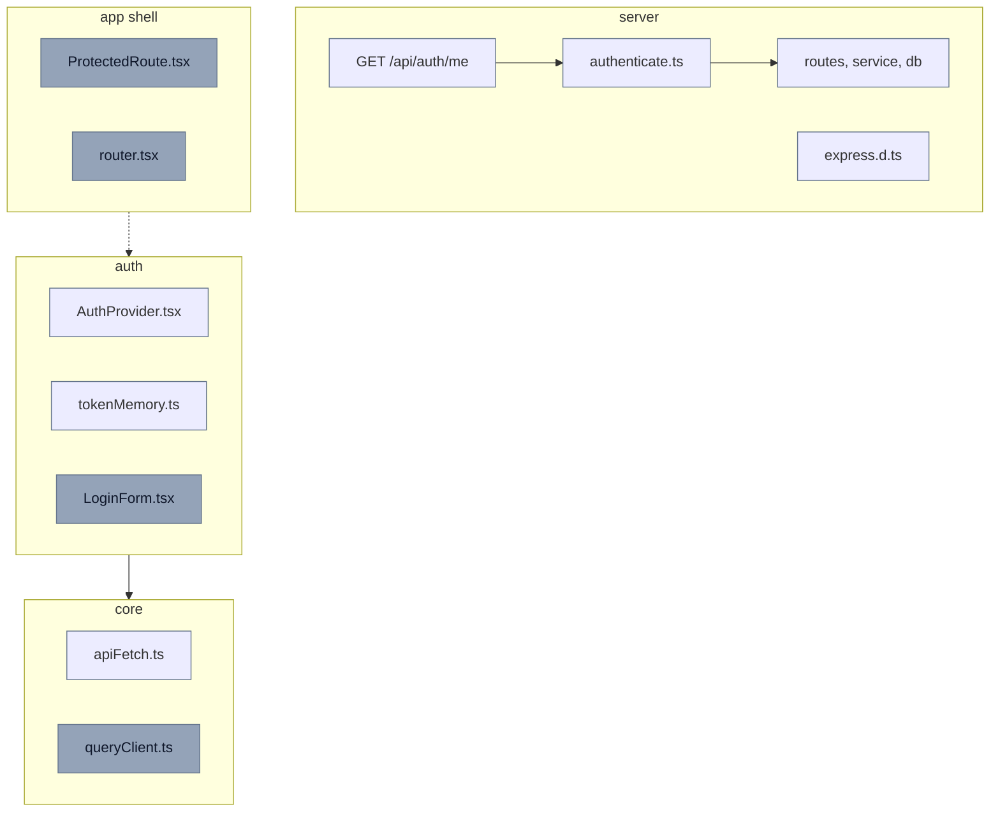

# US 2.2.1 #2 — Session (Server gate + Client)

> **Канон:** [CURRENT_RELEASE.md](../../CURRENT_RELEASE.md) § Инкремент #2. **WIP-правки:** [CURRENT_INCREMENT.md](../../CURRENT_INCREMENT.md). Этот файл — зеркало структуры.

**Статус:** `done` — **Фаза A: Server** ✅ | **Фаза B: Client** ✅  
**Релиз:** [CURRENT_RELEASE.md](../../CURRENT_RELEASE.md) — v2.2 Персонализация  
**Релиз-трекер:** таблица #1–#6 в [CURRENT_RELEASE.md](../../CURRENT_RELEASE.md)  
**Полная спека:** [CURRENT_RELEASE.md](../../CURRENT_RELEASE.md) — § Инкремент #2  
**Справочник:** [AUTH_REFERENCE.md](../AUTH_REFERENCE.md) — §C, legacy-фазы 2–3  
**Practice:** [PRACTICE_MODE.md](../../guides/PRACTICE_MODE.md)  
**Issue:** TBD — `npm run _ create-task "US 2.2.1: Session (Server + Client)"`  
**Предусловие:** US 2.2.1 Backend (#1) ✅ (#73)

> **Готово:** Фаза A ✅ | Фаза B ✅ | MSW `/api/auth/*` ✅ | vitest ✅ | ручная проверка ✅

**Не путать:** `tokenMemory` = access в RAM на клиенте | `authenticate` = сервер читает `Authorization: Bearer`

---

## Прогресс

| Фаза | Сделано | Осталось |
| ---- | ------- | -------- |
| A Server | `authenticate`, `express.d.ts`, `GET /me`, curl-чеклист | — |
| B Client | `tokenMemory`, `apiFetch`, `authPaths`, `authApi`, `AuthProvider`, `useAuth`, `main`, `newsQueries`, MSW, vitest | — |

| Файл | Статус |
| ---- | ------ |
| `server/src/types/express.d.ts` | ✅ в ветке |
| `server/src/middleware/authenticate.ts` | ✅ в ветке |
| `server/src/routes/auth/` — `GET /me` | ✅ в ветке |
| `client/src/shared/api/authPaths.ts` | ✅ в ветке |
| `client/src/pages/Auth/lib/tokenMemory.ts` | ✅ в ветке |
| `client/src/pages/Auth/lib/authApi.ts` | ✅ в ветке |
| `client/src/shared/api/apiFetch.ts` | ✅ в ветке (+ `AUTH_API_PATHS.refresh`) |
| `client/src/app/providers/AuthProvider.tsx` | ✅ в ветке |
| `client/src/pages/Auth/lib/useAuth.ts` | ✅ в ветке |
| `client/src/app/main.tsx` | ✅ `<AuthProvider>` обёртка |
| `client/src/model/news/api/tanstack/newsQueries.ts` | ✅ shared `apiFetch` |
| тесты + MSW `/api/auth/*` | ✅ в ветке |

---

## На схеме

**Мастер-схема:** A + §C ([AUTH_REFERENCE §C](../AUTH_REFERENCE.md))

### Ключевые решения

| Вопрос | Ответ |
| ------ | ----- |
| Откуда сервер берёт токен? | Заголовок `Authorization: Bearer …` в **HTTP-запросе** |
| Откуда клиент его кладёт? | `apiFetch` → `getAccessToken()` из `tokenMemory` |
| Где refresh? | httpOnly cookie → только `POST /api/auth/refresh`, **не** в `authenticate` |
| Куда вешать `authenticate`? | Только **protected** routes; **не** login / register / refresh / logout |
| `GET /api/news`? | Каталог **публичный**; Bearer на news — проверка `apiFetch` (Фаза B); middleware на `/api/news` не обязателен |

**Цепочка:** `login` / `refresh` → `accessToken` в body → `setAccessToken` → `apiFetch` шлёт Bearer → `authenticate` → `req.user`.





**Фаза A (server):**

| Файл | Действие | Статус |
| ---- | -------- | ------ |
| `server/src/types/express.d.ts` | новый | ✅ |
| `server/src/middleware/authenticate.ts` | новый | ✅ |
| `server/src/routes/auth/` | `GET /me` + `authenticate` | ✅ |

**Фаза B (client):**

| Файл | Действие | Статус |
| ---- | -------- | ------ |
| `client/src/shared/api/authPaths.ts` | новый | ✅ |
| `client/src/pages/Auth/lib/tokenMemory.ts` | новый | ✅ |
| `client/src/pages/Auth/lib/authApi.ts` | новый | ✅ |
| `client/src/shared/api/apiFetch.ts` | новый (+ paths) | ✅ |
| `client/src/app/providers/AuthProvider.tsx` | новый (+ `AuthContext`) | ✅ |
| `client/src/pages/Auth/lib/useAuth.ts` | скелет | ✅ |
| `client/src/app/main.tsx` | обёртка `<AuthProvider>` | ✅ |
| `client/src/model/news/api/tanstack/newsQueries.ts` | shared `apiFetch` | ✅ |

**Не в этом US:** `LoginForm.tsx`, `ProtectedRoute.tsx`, `router.tsx`, `queryClient.ts`, OpenAPI для `/me` (можно later)

**После US:** F5 → auto-login; GET `/api/news` через apiFetch с Bearer  
**Сцена timeline:** «Есть cookie?» → POST /refresh; GET /news → 401 → /refresh → retry  
**Полная карта:** [AUTH_REFERENCE §C](../AUTH_REFERENCE.md)

| Статус | Фон | Обводка | Текст |
| ------ | --- | ------- | ----- |
| done | нет (default) | тонкая `#64748b` | default |
| **active (WIP)** | `#dce4ef` | жирная `#334155` | `#0f172a` |
| later | `#94a3b8` | тонкая `#64748b` | `#0f172a` |



---

## Контракты

> Сигнатуры и HTTP-контракты **без реализации**. Детали сборки — в «Практика».

### Server

```typescript
// server/src/types/express.d.ts
declare namespace Express {
  interface Request {
    user?: { id: string; email: string }
  }
}

// server/src/middleware/authenticate.ts
export function authenticate(req, res, next): void

// GET /api/auth/me → 200 { id, email } | 401
export const getMe: RequestHandler
```

### Client — пути и HTTP

`AUTH_API_PATHS` — `shared/api/authPaths.ts`.  
Auth HTTP — `pages/Auth/lib/authApi.ts`: `postRefresh`, `postLogin`, `postLogout`, `establishSession`.

### Client — две «памяти»

| Где | Что | Зачем |
| --- | --- | ----- |
| `tokenMemory` | `accessToken` (строка) | `apiFetch` подставляет `Authorization` |
| `AuthProvider` state | `user: { id, email } \| null` | UI: «Добро пожаловать, Ivan» |

После F5 `tokenMemory` пустой → bootstrap через cookie → снова `setAccessToken` + `setUser`.

```typescript
export type AuthUser = { id: string; email: string }

export type AuthContextValue = {
  user: AuthUser | null
  isLoading: boolean
  isAuthenticated: boolean   // derived: user !== null — НЕ отдельный useState
  login: (email: string, password: string) => Promise<void>
  logout: () => Promise<void>
}

// tokenMemory — module-level, без React
export function getAccessToken(): string | null
export function setAccessToken(token: string): void
export function clearAccessToken(): void

export async function apiFetch<T>(path: string, init?: RequestInit): Promise<T>
export function useAuth(): AuthContextValue
export function AuthProvider(props: { children: React.ReactNode }): JSX.Element
```

`AuthContext` — `createContext<AuthContextValue | null>(null)` в `AuthProvider.tsx`.

| Метод контекста | Сигнатура | Возвращает | Поведение |
| --------------- | --------- | ---------- | --------- |
| `login` | `(email, password) => Promise<void>` | **void** — UI читает `user` из контекста | `POST /login` → establishSession → `setUser` |
| `logout` | `() => Promise<void>` | **void** | `POST /logout` → `clearAccessToken` → `setUser(null)` |

### HTTP-контракты

| Endpoint | Body response | Кто вызывает |
| -------- | ------------- | ------------ |
| `POST /api/auth/refresh` | `{ accessToken }` only | AuthProvider bootstrap |
| `POST /api/auth/login` | `{ accessToken }` only | AuthProvider.login |
| `GET /api/auth/me` | `{ id, email }` | после `setAccessToken` |
| `POST /api/auth/logout` | `{ ok: true }` | AuthProvider.logout |

**Подводные камни (AuthProvider / session):**

1. **`isLoading` начать с `false`** → мигание «гость» до refresh. Нужен `true`.
2. **Ждать `user` в body `/login` или `/refresh`** — сервер отдаёт только `accessToken`; user через `/me`.
3. **`login` возвращает `user` или `token`** — не надо; UI читает `user` из контекста после `setUser`.
4. **`logout` синхронный** — лучше `async`, дождаться `POST /logout` (очистка cookie на сервере).
5. **Дублировать refresh в AuthProvider и apiFetch** — bootstrap один раз при mount; дальше 401 ловит `apiFetch`.
6. **`useLayoutEffect`, не `useEffect`** — нет FOUC «гость» до bootstrap.
7. **`authenticate` на server** — без `return` после 401 выполнится `next()` для гостя; `jwt.verify` **бросает**, не возвращает `false`.

---

## Зачем этот US

**Фаза A:** сервер по JWT в заголовке знает **кто** вызывает protected route (`req.user`).

**Фаза B:** клиент после Backend (#1) **хранит access в RAM**, **bootstrap по cookie** после F5 и **единый apiFetch** с interceptor — чтобы catalog (news) и позже engagement ходили через один gate.

---

## Acceptance Criteria

### Фаза A — Server

- [x] `server/src/middleware/authenticate.ts` — Bearer → `jwt.verify` → `req.user`
- [x] `server/src/types/express.d.ts` — `declare namespace Express { interface Request { user? } }`
- [x] `GET /api/auth/me` в `server/src/routes/auth/` + `authenticate` на роуте
- [x] curl: с Bearer → 200 `{ id, email }`; без / невалидный токен → 401
- [x] Middleware **не** на `/api/auth/login`, `/register`, `/refresh`, `/logout`

### Фаза B — Client

- [x] Access token в `tokenMemory` (RAM): get / set / clear
- [x] F5 → bootstrap через `POST /api/auth/refresh` (`AuthProvider`, `useLayoutEffect`)
- [x] `apiFetch`: `credentials: 'include'`, Bearer, 401 → refresh → retry
- [x] `newsQueries.ts` → shared `apiFetch`

### Финал под-инкремента #2 (после A + B)

- [x] F5 с refresh cookie → user восстановлен (не «гость»)
- [x] Network: GET `/api/news` с заголовком `Authorization: Bearer`

---

## Git

**Ветка:** `v2.2.0-auth`  
**Issue:** TBD — `npm run _ create-task "US 2.2.1: Session (Server + Client)"`

---

## Практика

> Формат: [PRACTICE_MODE.md](../../guides/PRACTICE_MODE.md) — только сигнатуры и `//` комментарии внутри `{ }`.

### Порядок сборки (Фаза B)

1. `AuthProvider.tsx` — типы + Provider + bootstrap
2. `useAuth.ts` — guard context
3. `main.tsx` — обёртка
4. `newsQueries.ts` — import shared `apiFetch`
5. MSW handlers `/api/auth/*`
6. vitest

---

## Фаза A — Server ✅

> Код в ветке — см. файлы ниже. Осталось прогнать curl-чеклист в «Проверка и тесты».

### `server/src/types/express.d.ts` — ✅ в ветке

```typescript
declare namespace Express {
  interface Request {
    user?: { id: string; email: string }
  }
}
```

**Подводный камень:** не глобальный `interface Request` — только `declare namespace Express`, иначе `req.user` не типизируется.

---

### `server/src/middleware/authenticate.ts` — ✅ в ветке

```typescript
export function authenticate(req, res, next) {
  // Шаг 1: req.headers.authorization — префикс Bearer с пробелом
  // Шаг 2: вырезать token; jwt.verify в try/catch (секрет = JWT_ACCESS_SECRET из authService)
  // Шаг 3: payload { sub, email } → req.user = { id: sub, email }
  // Шаг 4: next(); на ошибку / нет заголовка → return res.status(401).json(...)
  // Не вешать на /login, /register, /refresh, /logout
}
```

---

### `server/src/routes/auth/` — `GET /me` — ✅ в ветке

```typescript
export const getMe: RequestHandler = (req, res) => {
  // req.user гарантирован после authenticate
  // res.json({ id: req.user!.id, email: req.user!.email })
}

// routes.ts: authRouter.get('/me', authenticate, getMe)
```

OpenAPI для `/me` — optional, не блокирует Фазу A.

---

## Фаза B — Client

> **Следующий шаг:** шаги 1–6 из «Порядок сборки» выше.

### `client/src/pages/Auth/lib/tokenMemory.ts` — ✅ в ветке

```typescript
// module-level variable — без subscribe

export function getAccessToken() {
  // вернуть текущий access или null
}

export function setAccessToken(token: string) {
  // записать в module variable
}

export function clearAccessToken() {
  // null
}
```

---

### `client/src/shared/api/apiFetch.ts` — ✅ в ветке

```typescript
export async function apiFetch<T>(path: string, init?: RequestInit): Promise<T> {
  // Шаг 1: credentials: 'include'
  // Шаг 2: Authorization: Bearer getAccessToken()
  // Шаг 3: fetch → если 401: single-flight POST /api/auth/refresh
  // Шаг 4: setAccessToken → retry original once
  // Шаг 5: refresh fail → clearAccessToken → throw
}
```

---

### Шаг 1 — `client/src/app/providers/AuthProvider.tsx` — ✅ в ветке

> Реализация через `authApi`; см. `client/src/app/providers/AuthProvider.tsx`.

```typescript
export type AuthUser = { id: string; email: string }

export type AuthContextValue = {
  user: AuthUser | null
  isLoading: boolean
  isAuthenticated: boolean
  login: (email: string, password: string) => Promise<void>
  logout: () => Promise<void>
}

export function AuthProvider({ children }) {
  // useState: user null, isLoading true  ← не false!
  // AuthContext = createContext<AuthContextValue | null>(null)

  // establishSession(accessToken):
  //   setAccessToken(accessToken)
  //   GET /api/auth/me с Bearer → AuthUser

  // useLayoutEffect bootstrap (не useEffect!):
  //   POST /api/auth/refresh, credentials include, БЕЗ Authorization
  //   401 → clearAccessToken, setUser null
  //   200 → establishSession → setUser
  //   finally → setIsLoading false
  //   cleanup: cancelled flag

  // login(email, password): POST /login → establishSession → setUser; void return
  // logout(): POST /logout → finally clearAccessToken + setUser null

  // value: user, isLoading, isAuthenticated, login, logout
  // return AuthContext.Provider
}
```

Пока `isLoading === true`, `ProtectedRoute` (US 2.2.5) ничего не редиректит.

---

### Шаг 2 — `client/src/pages/Auth/lib/useAuth.ts` — ✅

```typescript
export function useAuth(): AuthContextValue {
  // useContext(AuthContext)
  // if !ctx → throw must be used within AuthProvider
  // return ctx
}
```

Контекст объявлен в `AuthProvider.tsx` — отдельный `authContext.ts` не нужен.

---

### Шаг 3 — `client/src/app/main.tsx` — ✅

```typescript
// ====== ИЗМЕНЁННЫЙ БЛОК US 2.2.1 Client ======
// import AuthProvider
// внутри QueryClientProvider обернуть RouterProvider в AuthProvider
// порядок: QueryClientProvider → AuthProvider → RouterProvider
```

---

### Шаг 4 — `client/src/model/news/api/tanstack/newsQueries.ts` — ✅

```typescript
// ====== ИЗМЕНЁННЫЙ БЛОК ======
// 1. Удалить локальный async function apiFetch и const BASE_URL
// 2. import { apiFetch } from '@shared/api/apiFetch'
// 3. Пути остаются: `/api/news?...`, `/api/news/${id}`, `/api/feedback`
```

После замены GET `/api/news` в Network должен содержать `Authorization: Bearer` (если access в `tokenMemory`).

---

### Шаг 5 — MSW handlers — ✅

Добавить в `client/src/app/mocks/handlers.ts`:

| Handler | Ответ |
| ------- | ----- |
| `POST */api/auth/refresh` | 200 `{ accessToken: 'mock-access' }` или 401 без cookie |
| `GET */api/auth/me` | 200 `{ id, email }` при Bearer; 401 без |
| `POST */api/auth/login` | опционально для тестов форм (US 2.2.4) |
| `POST */api/auth/logout` | 200 `{ ok: true }` |

---

## Проверка и тесты

> US **не закрывается** без отмеченных `- [ ]` ниже. См. [PRACTICE_MODE.md](../../guides/PRACTICE_MODE.md).

### Фаза A — ручная (обязательно)

> Достаточно curl; server test runner не настроен.

```bash
pnpm dev:server
```

| # | Input | Output |
| - | ----- | ------ |
| 1 | `POST /api/auth/login` → `accessToken` в JSON | 200, токен в ответе |
| 2 | `GET /api/auth/me` + `Authorization: Bearer <accessToken>` | 200 `{ id, email }` |
| 3 | `GET /api/auth/me` без Bearer | 401 |

```bash
curl -s -X POST http://localhost:3001/api/auth/login \
  -H "Content-Type: application/json" \
  -d '{"email":"YOUR_EMAIL","password":"YOUR_PASSWORD"}'

curl -s http://localhost:3001/api/auth/me \
  -H "Authorization: Bearer <accessToken>"

curl -s -o /dev/null -w "%{http_code}\n" http://localhost:3001/api/auth/me
```

- [x] `/me` с Bearer → 200
- [x] `/me` без Bearer → 401
- [x] `authenticate` не на login/register/refresh/logout

---

### Фаза B — ручная (обязательно)

| # | Input | Output |
| - | ----- | ------ |
| 1 | Login через curl → открыть app с cookie | F5 → user восстановлен, не «гость» |
| 2 | GET `/api/news` в Network | Request с `Authorization: Bearer` |

- [x] F5 bootstrap
- [x] news через apiFetch с Bearer

---

### Автотесты — Фаза B (обязательно)

- [x] `client/src/pages/Auth/lib/tokenMemory.test.ts`

```typescript
describe('tokenMemory', () => {
  it('set/get/clear access token', () => {
    // setAccessToken('x') → getAccessToken() === 'x'
    // clearAccessToken() → null
  })
})
```

- [x] `client/src/shared/api/apiFetch.test.ts` — MSW: 401 → refresh → retry

```typescript
describe('apiFetch', () => {
  it('retries after refresh on 401', () => {
    // MSW: first GET /api/news → 401; POST /refresh → 200 + token; retry → 200
  })
})
```

- [x] `client/src/app/providers/AuthProvider.test.tsx` — bootstrap 200/401

- [x] MSW handlers `/api/auth/*` в `handlers.ts`

```bash
pnpm --filter react-happy-news-client exec vitest run src/pages/Auth/lib/tokenMemory.test.ts
pnpm --filter react-happy-news-client exec vitest run src/shared/api/apiFetch.test.ts
pnpm --filter react-happy-news-client exec vitest run src/app/providers/AuthProvider.test.tsx
```

---

## Запуск

**Фаза A:**

```bash
pnpm dev:server
# curl login → /api/auth/me (см. таблицу выше)
```

**Фаза B:**

```bash
pnpm dev:server   # терминал 1
pnpm dev:client   # терминал 2
# login через curl или временный fetch в console → F5
pnpm --filter react-happy-news-client exec vitest run src/pages/Auth/lib/tokenMemory.test.ts
```

**Git (два коммита — опционально):**

```bash
# Фаза A
git add server/src/middleware/ server/src/types/ server/src/routes/auth/
git commit -m "feat: #N authenticate middleware + GET /api/auth/me"

# Фаза B
git add client/src/pages/Auth/ client/src/app/providers/ client/src/shared/api/ client/src/model/news/api/tanstack/ client/src/app/mocks/
git commit -m "feat: #N tokenMemory + AuthProvider + apiFetch"
```

---

## Самопроверка

**После Фазы A:**

1. Что читает `authenticate`? Почему не `tokenMemory`?

**После Фазы B:**

1. Зачем Context **и** tokenMemory? → [AUTH_REFERENCE §C](../AUTH_REFERENCE.md)
2. Почему `useLayoutEffect`? → нет FOUC «гость»
3. apiFetch при 401? → single-flight refresh + retry
4. Откуда `user` после `/refresh`? → `GET /api/auth/me`, не body refresh
5. Что возвращает `login`? → `void`, не `{ user }` — UI читает `user` из контекста
6. Зачем `login`/`logout` уже в 2.2.1? → контракт для US 2.2.4; минимальная реализация ок

---

## Следующий US

[US-2.2.4-forms.md](./US-2.2.4-forms.md)
