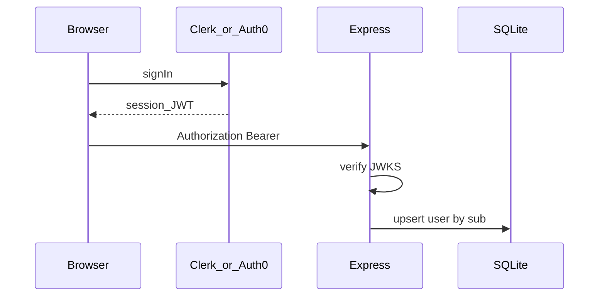

# US 2.2.13 #6b — Managed Auth Migration

> **Рабочий план:** [CURRENT_INCREMENT.md](../../CURRENT_INCREMENT.md) после 6a  
> **ADR:** [MANAGED_AUTH_ADR.md](../MANAGED_AUTH_ADR.md) — Decision **accepted**

**Статус:** `pending`  
**Релиз:** [CURRENT_RELEASE.md](../../CURRENT_RELEASE.md) — auth-трек **#6b**  
**Полная спека:** [CURRENT_RELEASE.md](../../CURRENT_RELEASE.md) — § US 2.2.13 (#6b)  
**Issue:** [#74](https://github.com/vv0rkz/react-happy-news/issues/74)  
**Предусловие:** [US-2.2.13-6a-adr.md](./US-2.2.13-6a-adr.md) ✅, ADR signed-off

---

## Контекст за 30 секунд



| Слой | Было (DIY) | Станет |
|------|------------|--------|
| Login UI | LoginForm / RegisterForm | Hosted UI или provider components |
| Access token | `tokenMemory` + `/refresh` | Provider session token |
| `authenticate` | `jwt.verify(JWT_ACCESS_SECRET)` | JWKS issuer провайдера |
| Refresh cookie | httpOnly `refreshToken` | У провайдера |

---

## Acceptance Criteria

- [ ] Env: ключи провайдера в `client/.env` + `server/.env` (не коммитить)
- [ ] Client: `ClerkProvider` / `Auth0Provider` в `app`
- [ ] `apiFetch`: Bearer от провайдера, `credentials` по доке провайдера
- [ ] Server: `authenticate.ts` → verify JWT (JWKS)
- [ ] `GET /api/auth/me` — `{ id, email }` из claims; route + `authenticate`
- [ ] F5: сессия без `POST /api/auth/refresh`
- [ ] Google login через dashboard провайдера
- [ ] Deprecated: `POST /api/auth/register|login|refresh|logout` → 410 или удалить routes
- [ ] `users.id` = `sub`; upsert при первом protected request
- [ ] `pnpm gen:openapi:sync` (сервер запущен)

---

## На схеме

| Файл | Действие |
| ---- | -------- |
| `app/providers/` | Provider wrapper |
| `shared/api/apiFetch.ts` | Bearer от провайдера |
| `pages/Auth/` | Упростить / hosted UI |
| `server/src/middleware/authenticate.ts` | JWKS |
| `server/src/routes/auth/` | Удалить или 410 legacy handlers |
| `server/.env.example` | `CLERK_*` или `AUTH0_*` |

---

## Практика (Clerk — default)

### Client

```bash
pnpm --filter react-happy-news-client add @clerk/clerk-react
```

- `VITE_CLERK_PUBLISHABLE_KEY` в `client/.env`
- Обернуть app в `ClerkProvider`
- `useAuth().getToken()` → `apiFetch` Authorization

### Server

```bash
pnpm --filter react-happy-news-server add @clerk/express
# или @clerk/backend для ручного verify
```

- Middleware или ручной verify JWT в `authenticate`
- `req.user = { id: sub, email }`

### Auth0 (если выбран в ADR)

- `@auth0/auth0-react` + `express-oauth2-jwt-bearer`
- Audience + issuer в env

---

## Проверка и тесты

- [ ] Register/login через UI провайдера
- [ ] Network: API с `Authorization: Bearer`
- [ ] Logout — сессия сброшена
- [ ] `curl` старый `/api/auth/login` → 404/410
- [ ] Protected route ( `/me` или будущие favorites) с Bearer → 200

---

## Не в scope

- Миграция bcrypt-пользователей (re-register)
- US 2.2.2 Favorites (следующий US после #6)
- 2.2.9 GDPR (отдельно)

---

## Следующий шаг

[CURRENT_RELEASE.md](../../CURRENT_RELEASE.md) — **US 2.2.2 Избранное** (на JWT провайдера)
