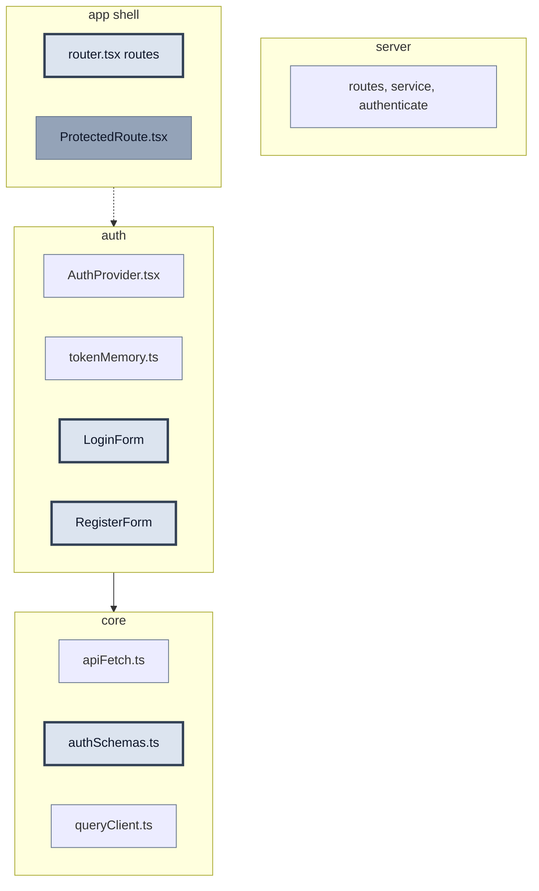

# US 2.2.4 #3 — Auth Forms (RHF + Zod)

> **Канон:** [CURRENT_RELEASE.md](../../CURRENT_RELEASE.md) § Инкремент #3. **WIP-правки:** [CURRENT_INCREMENT.md](../../CURRENT_INCREMENT.md). Этот файл — зеркало структуры.

**Статус:** `active`  
**Релиз:** [CURRENT_RELEASE.md](../../CURRENT_RELEASE.md) — v2.2 Персонализация  
**Релиз-трекер:** таблица #1–#6 в [CURRENT_RELEASE.md](../../CURRENT_RELEASE.md)  
**Полная спека:** [CURRENT_RELEASE.md](../../CURRENT_RELEASE.md) — § Инкремент #3  
**Справочник:** [AUTH_REFERENCE.md](../AUTH_REFERENCE.md) — §A Module Map  
**Practice:** [PRACTICE_MODE.md](../../guides/PRACTICE_MODE.md)  
**Issue:** TBD — `npm run _ create-task "US 2.2.4: Auth Forms (RHF + Zod)"`  
**Предусловие:** US 2.2.1 Session (#2) ✅

> **Сейчас:** шаг 0 — deps (`react-hook-form`, `@hookform/resolvers`) → `authSchemas` → формы → роуты  
> **Готово:** #1 Backend ✅ | #2 Session ✅ (`AuthProvider.login`, `apiFetch`, MSW login/refresh/me/logout)

> **Не в этом US:** `ProtectedRoute.tsx`, `React.lazy` для Auth pages — US 2.2.5  
> **arch-lint:** формы и страницы — в `pages/Auth/components/<Name>/<Name>.tsx`, не flat в page root

---

## Прогресс

| Шаг | Сделано | Осталось |
| --- | ------- | -------- |
| 0 deps | — | `react-hook-form`, `@hookform/resolvers` |
| 1 schemas + API | — | `authSchemas`, `postRegister`, `register` в контексте |
| 2 UI | — | LoginForm, RegisterForm, LoginPage, RegisterPage |
| 3 wiring | — | `routes.ts`, `router.tsx`, MSW `/register`, vitest |

| Файл | Статус |
| ---- | ------ |
| `client/src/shared/api/authSchemas.ts` | ⏳ |
| `client/src/shared/api/authPaths.ts` — `register` | ⏳ |
| `client/src/pages/Auth/lib/authApi.ts` — `postRegister` | ⏳ |
| `client/src/app/providers/AuthProvider.tsx` — `register` | ⏳ |
| `client/src/pages/Auth/components/LoginForm/` | ⏳ |
| `client/src/pages/Auth/components/RegisterForm/` | ⏳ |
| `client/src/pages/Auth/components/LoginPage/` | ⏳ |
| `client/src/pages/Auth/components/RegisterPage/` | ⏳ |
| `client/src/shared/config/routes.ts` | ⏳ |
| `client/src/app/router.tsx` | ⏳ |
| MSW `POST /api/auth/register` + form tests | ⏳ |

---

## На схеме

**Мастер-схема:** A — Module Map ([AUTH_REFERENCE §A](../AUTH_REFERENCE.md))

**В этом US:**

| Файл | Действие |
| ---- | -------- |
| `shared/api/authSchemas.ts` | новый |
| `pages/Auth/components/LoginForm/` | новый |
| `pages/Auth/components/RegisterForm/` | новый |
| `pages/Auth/components/LoginPage/` | новый |
| `pages/Auth/components/RegisterPage/` | новый |
| `shared/config/routes.ts` | изменить |
| `app/router.tsx` | изменить — `/login`, `/register` |

**Не в этом US:** `ProtectedRoute.tsx`, `React.lazy` — US 2.2.5

**После US:** UI login/register; submit → `POST /api/auth/*`  
**Сцена timeline:** Check-in login — POST /login → boarding pass + Set-Cookie  
**Полная карта:** [AUTH_REFERENCE](../AUTH_REFERENCE.md)

| Статус | Фон | Обводка | Текст |
| ------ | --- | ------- | ----- |
| done | нет (default) | тонкая `#64748b` | default |
| **active (WIP)** | `#dce4ef` | жирная `#334155` | `#0f172a` |
| later | `#94a3b8` | тонкая `#64748b` | `#0f172a` |



---

## Контракты

> Сигнатуры и HTTP-контракты **без реализации**. Детали сборки — в «Практика».

### Zod schemas

```typescript
// client/src/shared/api/authSchemas.ts
export const loginSchema = z.object({
  email: z.string().email('Invalid email'),
  password: z.string().min(1, 'Password required'),
})

export const registerSchema = z.object({
  email: z.string().email('Invalid email'),
  password: z
    .string()
    .min(8, 'Min 8 characters')
    .regex(/[A-Z]/, 'Need uppercase')
    .regex(/\d/, 'Need digit'),
})

export type LoginFormValues = z.infer<typeof loginSchema>
export type RegisterFormValues = z.infer<typeof registerSchema>
```

### Auth context (расширение)

```typescript
export type AuthContextValue = {
  user: AuthUser | null
  isLoading: boolean
  isAuthenticated: boolean
  login: (email: string, password: string) => Promise<void>
  register: (email: string, password: string) => Promise<void>  // новый
  logout: () => Promise<void>
}
```

### HTTP

| Endpoint | Body response | Кто вызывает |
| -------- | ------------- | ------------ |
| `POST /api/auth/login` | `{ accessToken }` | `LoginForm` → `useAuth().login` |
| `POST /api/auth/register` | `{ accessToken }` (201) | `RegisterForm` → `useAuth().register` |
| `POST /api/auth/register` | 409 `{ error }` | → `setError('email', …)` |

**Контракт submit:**

- `LoginForm` → `await login(email, password)` — **void**; `user` из context после `setUser`
- `RegisterForm` → `await register(email, password)` — симметрия с login; 409 → field error, не throw в UI

**Подводные камни:**

1. **Без native `<form>`** — password manager не подхватывает поля.
2. **`current-password` vs `new-password`** — login vs register autocomplete.
3. **409 на register** — `setError('email')`, не общий alert.
4. **Схемы в `shared/api`** — core module; формы в `pages/Auth` импортируют схемы, не дублируют Zod.
5. **Barrels `index.ts`** — не править вручную; pre-commit `gen:barrels`.

---

## Зачем этот US

#1–#2 дали API и session layer (`AuthProvider`, `apiFetch`, bootstrap по cookie). Здесь **UI check-in**: пользователь вводит email/password, RHF + Zod валидируют до запроса, submit идёт через `useAuth().login` / `register`.

---

## Acceptance Criteria

- [ ] RHF + Zod на Login/Register
- [ ] `/login`, `/register` с валидацией (роуты в `router.tsx`)
- [ ] Submit → `POST /api/auth/login` / `register`
- [ ] 409 на register → field error на `email`
- [ ] native `<form>` + `autocomplete` attributes

---

## Git

**Ветка:** `v2.2.0-auth`  
**Issue:** TBD

---

## Практика

> Формат: [PRACTICE_MODE.md](../../guides/PRACTICE_MODE.md) — import map над экспортом (см. § Импорты); только сигнатуры и `//` комментарии внутри `{ }`.

### Порядок сборки

1. deps — `react-hook-form`, `@hookform/resolvers`
2. `authSchemas.ts`
3. `authPaths` + `postRegister` + `register` в `AuthProvider`
4. `LoginForm` → `LoginPage`
5. `RegisterForm` → `RegisterPage`
6. `routes.ts` + `router.tsx`
7. MSW `/register` + vitest

---

### Шаг 0: deps

```bash
pnpm --filter react-happy-news-client add react-hook-form @hookform/resolvers
```

`zod` уже в client.

---

### `client/src/shared/api/authSchemas.ts` — ⏳

```typescript
import { z } from 'zod'

export const loginSchema = z.object({
  email: z.string().email('Invalid email'),
  password: z.string().min(1, 'Password required'),
})

export const registerSchema = z.object({
  email: z.string().email('Invalid email'),
  password: z
    .string()
    .min(8, 'Min 8 characters')
    .regex(/[A-Z]/, 'Need uppercase')
    .regex(/\d/, 'Need digit'),
})

export type LoginFormValues = z.infer<typeof loginSchema>
export type RegisterFormValues = z.infer<typeof registerSchema>
```

---

### `authPaths.ts` + `authApi.ts` — ⏳

```typescript
// authPaths.ts — добавить (импорты не меняются)
register: '/api/auth/register'

// authApi.ts — postRegister (mirror postLogin)
// Импорты уже в файле: AUTH_API_PATHS, BASE_URL через import.meta.env
// Для 409: export class AuthApiError extends Error { status: number }

export async function postRegister(email: string, password: string): Promise<string> {
  // POST credentials include, JSON body
  // 409 → throw new AuthApiError(body.error ?? 'Register failed', res.status)
  // 201 → return accessToken
}
```

---

### `AuthProvider.tsx` — `register` — ⏳

```typescript
// postRegister уже импортирован из @pages/Auth/lib/authApi

async function register(email: string, password: string): Promise<void> {
  // const accessToken = await postRegister(email, password)
  // const me = await establishSession(accessToken)
  // setUser(me)
}

// value: добавить register в AuthContext.Provider
```

---

### `client/src/pages/Auth/components/LoginForm/LoginForm.tsx` — ⏳

```typescript
import { zodResolver } from '@hookform/resolvers/zod'
import { Button, Stack, TextInput } from '@mantine/core'
import { useAuth } from '@pages/Auth/lib/useAuth'
import { loginSchema, type LoginFormValues } from '@shared/api/authSchemas'
import { useForm } from 'react-hook-form'

export function LoginForm() {
  // const { register, handleSubmit, formState: { errors, isSubmitting } } = useForm<LoginFormValues>({ resolver: zodResolver(loginSchema) })
  // Шаг 1: useForm({ resolver: zodResolver(loginSchema) })
  // Шаг 2: const { login } = useAuth()
  // Шаг 3: onSubmit(data) → await login(data.email, data.password)
  // Шаг 4: native <form onSubmit={handleSubmit(onSubmit)}>
  // Шаг 5: Mantine TextInput {...register('email')} — autocomplete email, current-password
  // Шаг 6: error={errors.email?.message} на TextInput (не отдельный InputError)
}
```

---

### `client/src/pages/Auth/components/RegisterForm/RegisterForm.tsx` — ⏳

```typescript
import { zodResolver } from '@hookform/resolvers/zod'
import { Button, Stack, TextInput } from '@mantine/core'
import { useAuth } from '@pages/Auth/lib/useAuth'
import { registerSchema, type RegisterFormValues } from '@shared/api/authSchemas'
import { useForm } from 'react-hook-form'

export function RegisterForm() {
  // const { register, handleSubmit, setError, formState: { errors, isSubmitting } } = useForm<RegisterFormValues>({ resolver: zodResolver(registerSchema) })
  // Шаг 1: useForm + zodResolver(registerSchema)
  // Шаг 2: const { register: registerUser } = useAuth()
  // Шаг 3: onSubmit → try registerUser; catch AuthApiError status 409 → setError('email', { message })
  // Шаг 4: autocomplete new-password; error={errors.password?.message} на TextInput
}
```

---

### `LoginPage` / `RegisterPage` — ⏳

```typescript
// pages/Auth/components/LoginPage/LoginPage.tsx
import { Container } from '@mantine/core'
import { LoginForm } from '../LoginForm'  // после gen:barrels — @pages/Auth/components/LoginForm

export function LoginPage() {
  // Container size="lg" py="xl" + LoginForm (стиль как Main.tsx)
}

// pages/Auth/components/RegisterPage/RegisterPage.tsx
import { Container } from '@mantine/core'
import { RegisterForm } from '../RegisterForm'  // после gen:barrels — @pages/Auth/components/RegisterForm

export function RegisterPage() {
  // Container + RegisterForm
}
```

---

### `shared/config/routes.ts` + `app/router.tsx` — ⏳

```typescript
// routes.ts — добавить (импорты не меняются)
login: '/login',
register: '/register',

// router.tsx — ====== ИЗМЕНЁННЫЙ БЛОК US 2.2.4 ======
import { LoginPage } from '@pages/Auth/components/LoginPage'
import { RegisterPage } from '@pages/Auth/components/RegisterPage'
// APP_ROUTES уже импортирован

// children: { path: APP_ROUTES.login, element: <LoginPage /> }
//           { path: APP_ROUTES.register, element: <RegisterPage /> }
// React.lazy — в US 2.2.5
```

---

### MSW `handlers.ts` — `POST /api/auth/register` — ⏳

```typescript
// Импорты уже в handlers.ts: http, HttpResponse, MOCK_ACCESS_TOKEN, MOCK_USER
// Добавить handler POST /api/auth/register → 201 { accessToken } или 409 { error }
```

---

## Проверка и тесты

> US **не закрывается** без отмеченных `- [ ]` ниже. См. [PRACTICE_MODE.md](../../guides/PRACTICE_MODE.md).

### Ручная (обязательно)

| # | Input | Output |
| - | ----- | ------ |
| 1 | `/login` invalid email | validation errors, no request |
| 2 | `/login` valid credentials | logged in, token in memory |
| 3 | `/register` duplicate email | field error 409 |
| 4 | `/register` weak password | Zod error before submit |
| 5 | DevTools → inputs | `autocomplete` present |

- [ ] validation на login/register
- [ ] successful login
- [ ] 409 на register
- [ ] autocomplete attributes в DOM

### Автотесты (обязательно)

- [ ] `pages/Auth/components/LoginForm/LoginForm.test.tsx`

```typescript
import { AuthProvider } from '@app/providers/AuthProvider'
import { server } from '@app/mocks/server'
import { MantineProvider } from '@mantine/core'
import { render, screen, waitFor } from '@testing-library/react'
import userEvent from '@testing-library/user-event'
import { http, HttpResponse } from 'msw'
import { beforeEach, describe, expect, it } from 'vitest'
import { LoginForm } from './LoginForm'

describe('LoginForm', () => {
  it('shows validation error for invalid email', () => {
    // render: MantineProvider + AuthProvider + LoginForm
    // userEvent → expect error text, no fetch
  })
  it('calls login on valid submit', () => {
    // MSW POST /api/auth/login → 200
  })
})
```

- [ ] `pages/Auth/components/RegisterForm/RegisterForm.test.tsx` — weak password + 409 → field error

```typescript
import { AuthProvider } from '@app/providers/AuthProvider'
import { server } from '@app/mocks/server'
import { MantineProvider } from '@mantine/core'
import { render, screen, waitFor } from '@testing-library/react'
import userEvent from '@testing-library/user-event'
import { http, HttpResponse } from 'msw'
import { beforeEach, describe, expect, it } from 'vitest'
import { RegisterForm } from './RegisterForm'

describe('RegisterForm', () => {
  it('shows Zod error for weak password', () => {
    // render + submit weak password → expect validation error, no fetch
  })
  it('shows field error on 409 duplicate email', () => {
    // MSW POST /api/auth/register → 409 → expect email field error
  })
})
```

- [ ] MSW `POST /api/auth/register` в `handlers.ts`

```bash
pnpm --filter react-happy-news-client exec vitest run src/pages/Auth/components/LoginForm/LoginForm.test.tsx
pnpm --filter react-happy-news-client exec vitest run src/pages/Auth/components/RegisterForm/RegisterForm.test.tsx
```

---

## Запуск

```bash
pnpm dev
# http://localhost:5173/login , /register
pnpm --filter react-happy-news-client exec vitest run src/pages/Auth/components/LoginForm/LoginForm.test.tsx
```

```bash
git add client/src/pages/Auth/ client/src/shared/api/authSchemas.ts client/src/shared/config/routes.ts client/src/app/router.tsx client/src/app/mocks/
git commit -m "feat: #N Auth forms — RHF + Zod + login/register routes"
```

---

## Самопроверка

1. RHF + Zod при двух полях? → `useForm` + `zodResolver`
2. `current-password` vs `new-password`? → login vs register
3. Shared schema почему в `shared/api`? → core module, 2+ forms
4. Что возвращает `login` / `register`? → `void`; UI читает `user` из context
5. Почему `register` в AuthProvider, не только в форме? → единый session flow после register

---

## Следующий US

[CURRENT_RELEASE.md](../../CURRENT_RELEASE.md) — § Инкремент #4 Protected Routes + Lazy Loading (US 2.2.5)
