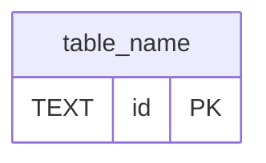

# Схема БД: до / после (SQLite)

> Когда US меняет [`server/src/db/schema.ts`](../../../server/src/db/schema.ts).  
> **Активный US:** полный блок Before/After/diff/проверка — в [`CURRENT_INCREMENT.md`](../CURRENT_INCREMENT.md) перед `### schema.ts`. Этот guide — общие правила и шаблон для копирования.

---

## Когда нужен этот guide

- US добавляет таблицы, колонки, индексы или `PRAGMA` в `schema.ts`
- В Practice есть комментарии `// CREATE TABLE …` или `// users: …`

Не нужен для чисто client-US без изменений SQLite.

---

## Откуда брать «было» и «станет»

| | Источник |
| --- | -------- |
| **Было** | Текущий код в [`server/src/db/schema.ts`](../../../server/src/db/schema.ts). Если инкремент пишет «из US X» — состояние после того US. |
| **Станет** | Блок `// CREATE TABLE` / изменения колонок в секции **Практика** [`CURRENT_INCREMENT.md`](../CURRENT_INCREMENT.md) |
| **Файл на диске** | `server/news.db` (создаётся при первом запуске сервера) |

Auth-таблицы **не связаны** с `news_items` — разные домены в одной SQLite-базе.

---

## Как читать ER-диаграммы

- Прямоугольник = таблица
- `PK` — primary key, `UK` — unique, `FK` — foreign key
- `users ||--o{ refresh_tokens` — у одного пользователя много refresh-токенов (one-to-many)

---

## US 2.2.1 — Backend Auth {#us-221-backend-auth}

Полный Before/After, таблица diff и проверка: [CURRENT_INCREMENT.md — Схема БД](../CURRENT_INCREMENT.md) (US 2.2.1, секция **Практика**).

---

## Проверка визуально

1. Реализуй `schema.ts` по Practice-блоку инкремента.
2. Запусти `pnpm dev:server` (создаст/обновит `server/news.db`).
3. Открой `server/news.db` в [DB Browser for SQLite](https://sqlitebrowser.org/) или расширении SQLite в VS Code.
4. Вкладка **Browse Data** — таблицы; **Database Structure** — ER-подобный список.
5. В CLI (если установлен `sqlite3`):

```bash
sqlite3 server/news.db ".schema"
```

Ожидаешь `CREATE TABLE users`, `CREATE TABLE refresh_tokens` и прежний `news_items`.

---

## Шаблон для нового US

При US, который меняет `schema.ts`: скопируй блок ниже **в `CURRENT_INCREMENT.md`** перед `### server/src/db/schema.ts` (заполни Before/After/diff). Опционально продублируй якорь в конец этого файла для архива закрытых US.

### US X.X.X — [название] {#us-xxx-slug}

**Инкремент:** …

#### Before



#### After


#### Таблица diff

| | До | После US X.X.X |
| --- | --- | --- |
| Таблицы | … | … |
| PRAGMA | … | … |
| Связи | … | … |

**Подводный камень:** …

---

## См. также

- [PRACTICE_MODE.md](./PRACTICE_MODE.md) — Practice-блоки и секции инкремента
- [INCREMENT_TEMPLATE.md](../templates/INCREMENT_TEMPLATE.md) — шаблон с опциональным блоком schema
