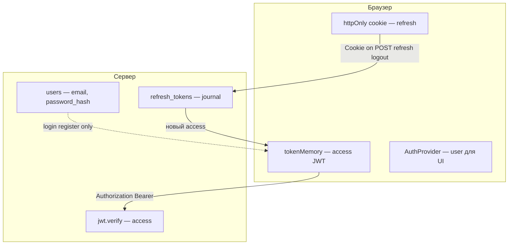
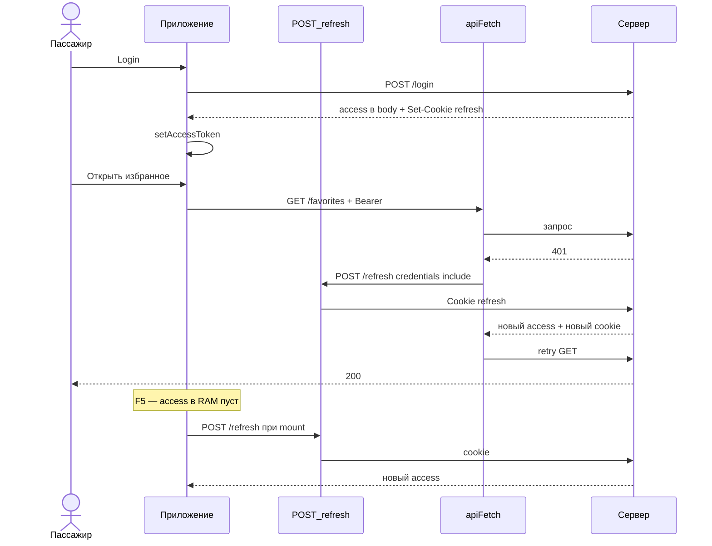
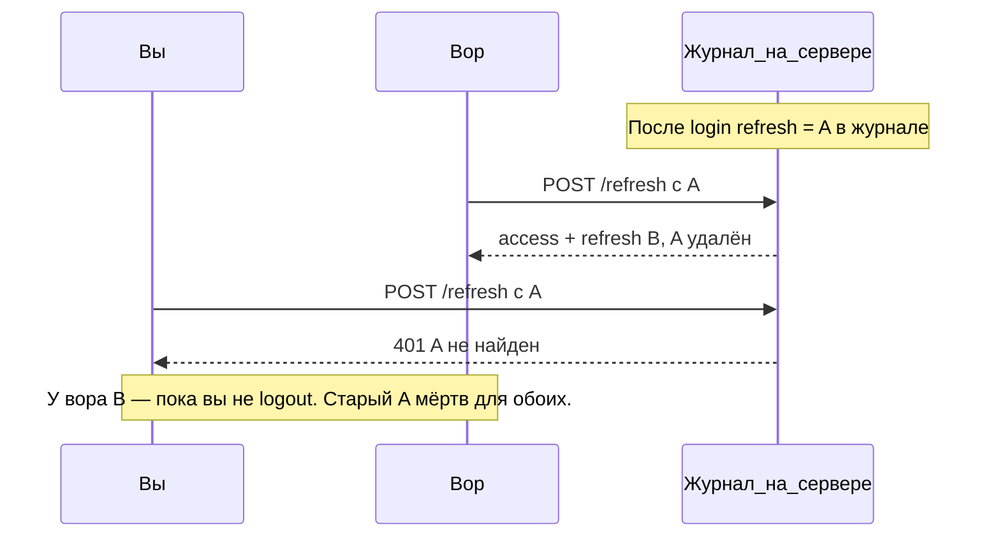

# Токены и JWT — гайд Happy News

> Развёрнутый разбор access / refresh для US 2.2.1: аналогии (аэропорт) + привязка к файлам и API.
> Краткий glossary: [ANALOGY_GUIDE.md](./ANALOGY_GUIDE.md). Research и Q-банк: [AUTH_REFERENCE.md](../auth/AUTH_REFERENCE.md).
> Активный инкремент: [CURRENT_INCREMENT.md](../CURRENT_INCREMENT.md).

---

## 1. Зачем читать

При реализации `authService`, `auth.routes` и (позже) `tokenMemory` / `apiFetch` легко смешать: что лежит в БД, что в cookie, что в «памяти» вкладки и зачем два токена. Этот документ собирает ответы на типичные вопросы **до** кода и связывает образы с конкретными путями в репозитории.

---

## 2. TL;DR — четыре места хранения

| В аэропорту | Термин | Где | Переживает F5? |
| ----------- | ------ | --- | -------------- |
| Архив пассажиров | Учётка (`users`, `password_hash`) | SQLite `server/src/db/schema.ts` | Да |
| Журнал активных сессий | Refresh (opaque token) | SQLite `refresh_tokens` + httpOnly cookie | Cookie да; access в RAM — нет |
| Талон в кармане | Access JWT | `client/.../tokenMemory.ts` (module `let`) | **Нет** |
| Браслет «запомнить меня» | Refresh в браузере | httpOnly cookie, выставляет `auth.routes` | Да (~7 дней) |

**Одна фраза:** архив — кто ты; журнал + браслет — долгая сессия; талон в кармане — частый короткий пропуск к API.

---

## 3. Сначала проблема, потом хранение

### Почему не один талон на год

Если один долгоживущий пропуск таскать на **каждую** дверь (каждый запрос к API), украли один раз — доступ на дни. Нужен **короткий** документ для частых проверок.

### Почему не только refresh на каждую дверь

Refresh — **сильный** ключ: по нему киоск выдаёт новые талоны. Светить им на каждый `GET /api/news` = таскать «паспорт с правом перевыпуска» в каждый магазин. Плюс каждая проверка — запрос в журнал (БД).

### Почему не один JWT на 7 дней в localStorage

Удобно в учебных проектах, но любой вредный JS на странице читает `localStorage`. В Happy News access **не** в localStorage; refresh — httpOnly cookie.

### Сравнение подходов

| Подход | Удобство | Риск при утечке | Как у нас |
| ------ | -------- | ----------------- | --------- |
| Один JWT 7d в localStorage | Высокое | Долгий полный доступ | Нет |
| Только refresh на все API | Среднее | Долгий + много поводов украсть | Нет |
| Access 15m + refresh 7d (opaque) + cookie | Среднее | Украли access — минуты; refresh реже и в cookie | **Да** |

---

## 4. Карта хранения



| В аэропорту | Термин | Где в коде | F5? |
| ----------- | ------ | ---------- | --- |
| Архив | `users` | `server/src/db/schema.ts` | — |
| Журнал сессий | `refresh_tokens` | `server/src/db/schema.ts` | — |
| Талон в кармане | Access JWT | `client/src/pages/Auth/lib/tokenMemory.ts` | Нет |
| Браслет | Refresh | `Set-Cookie` в `server/src/routes/auth.routes.ts` | Да |
| Табло «Ivan» | `user` | `client/src/app/providers/AuthProvider.tsx` | Восстанавливается через `/refresh` |

---

## 5. Access token = JWT

### Аналогия

**Штрихкод на посадочном талоне:** охранник у gate сверяет подпись, не открывая архив на каждого человека.

### Техника

Строка из трёх частей в Base64:

```text
header.payload.signature
```

| Часть | Содержимое |
| ----- | ---------- |
| header | алгоритм, например `HS256` |
| payload | `sub` (user id), опционально `email`, `exp` |
| signature | HMAC секретом сервера (`JWT_ACCESS_SECRET`) |

- **Выдача:** `jwt.sign(payload, secret, { expiresIn: '15m' })` в `authService.ts` (`jsonwebtoken`).
- **Проверка:** `jwt.verify(token, secret)` в `authenticate.ts` (client US) / middleware.

Access **не** хранится в SQLite: сервер доверяет подписи и `exp`. Журнал refresh для этого не нужен.

### Образ → код

| Образ | Термин | Файл / API |
| ----- | ------ | ---------- |
| Штрихкод на талоне | JWT access | `authService` — `jwt.sign` |
| Gate сверяет талон | verify | `authenticate.ts` — `jwt.verify` |
| Талон в руке | Bearer header | `apiFetch` — `Authorization: Bearer ${getAccessToken()}` |

---

## 6. Refresh token = opaque random

### Аналогия

**Номер в журнале на стойке:** снаружи — просто длинный номер; смысл только если администратор находит запись в журнале.

### Техника

- **Генерация:** `crypto.randomBytes(32).toString('hex')` (модуль `node:crypto`) — **не** `jsonwebtoken`.
- **Хранение:** `INSERT INTO refresh_tokens (token, user_id, expires_at)`.
- **Проверка:** `SELECT` по `token` + срок; на `/refresh` и logout.

### Почему не JWT для refresh

1. **Logout и rotation** всё равно требуют БД — self-contained JWT не избавляет от журнала.
2. **Отзыв:** `DELETE` строки → украденный номер мёртв сразу, не ждать `exp`.
3. **Меньше утечки данных** в самом токене (нет payload с `userId` в строке).
4. **Rotation:** старый номер сгорает, новый `INSERT` — явная смена сессии.

### Образ → код

| Образ | Термин | Файл / API |
| ----- | ------ | ---------- |
| Номер в журнале | opaque refresh | `authService` — `randomBytes` + SQLite |
| Браслет | httpOnly cookie | `auth.routes` — `Set-Cookie` |
| Киоск | обновление сессии | `POST /api/auth/refresh` |

---

## 7. «RAM» — это не localStorage

**RAM в документации проекта** = переменная на уровне модуля в `tokenMemory.ts`, а не отдельный Web API.

```typescript
// Упрощённо — не полная реализация
let accessToken: string | null = null;

export function getAccessToken() { return accessToken; }
export function setAccessToken(t: string) { accessToken = t; }
export function clearAccessToken() { accessToken = null; }
```

| Механизм | Переживает F5? | Кто читает из JS |
| -------- | -------------- | ---------------- |
| `let` в `tokenMemory.ts` | Нет | Ваш код (`getAccessToken`) |
| `localStorage` | Да | Любой скрипт на странице (XSS) |
| httpOnly cookie | Да | **Нельзя** через `document.cookie` |

После F5: карман пуст → `AuthProvider` вызывает `POST /api/auth/refresh` (браслет на месте) → `setAccessToken` снова.

---

## 8. httpOnly cookie

| Вопрос | Ответ |
| ------ | ----- |
| Может ли JS прочитать refresh? | **Нет** (флаг HttpOnly). |
| Как refresh попадает на сервер? | Браузер сам добавляет заголовок `Cookie:` на запросы к тому же сайту. |
| Что нужно в `fetch`? | `credentials: 'include'` на `/api/auth/refresh` и logout. |

Аналогия: браслет надели на стойке; вы не видите номер, но **киоск** его видит, когда вы подходите.

---

## 9. Связь access и refresh

**Неверно:** «refresh получаем из access».  
**Верно:** «**новый access** получаем **по** refresh», когда талон протух или пропал после F5.



---

## 10. Операции

### Register / Login

| Шаг | Сервер |
| --- | ------ |
| 1 | `bcrypt.hash` → `password_hash` |
| 2 | `INSERT INTO users` (register) или `SELECT` (login) |
| 3 | `jwt.sign` → access |
| 4 | `randomBytes` → refresh, `INSERT refresh_tokens` |
| 5 | Ответ: `{ accessToken }` + `Set-Cookie` refresh |

Псевдокод: [CURRENT_INCREMENT.md](../CURRENT_INCREMENT.md) — `authService.register` / `login`.

### Rotation на `/refresh`

| Шаг | Действие |
| --- | -------- |
| 1 | Найти refresh в cookie, проверить в `refresh_tokens` и `expires_at` |
| 2 | `DELETE` старый token |
| 3 | Новый `randomBytes`, `INSERT` |
| 4 | Новый `jwt.sign` (access) + `Set-Cookie` (новый refresh) |

Пользователь **ничего не нажимает** — киоск вызывается при F5 или при 401 в `apiFetch`.

### Logout

| Кто | Действие |
| --- | -------- |
| Сервер | `DELETE FROM refresh_tokens`, `Clear-Cookie` |
| Клиент | `clearAccessToken()`, `setUser(null)` |

### Если refresh украли

| Ситуация | Последствие |
| -------- | ------------- |
| Вор с копией cookie | Может ходить на `/refresh` и получать access, пока сессия в журнале жива |
| Вы сделали logout | Запись удалена — вору 401 |
| Вы (или сайт) сходили на киоск — rotation | Старый номер сгорел; у ворa старый refresh не работает |
| Access украли | Ущерб ~15 мин; refresh в httpOnly JS не достаёт |

---

## 11. Сценарий «два киоска» (rotation)



---

## 12. Маппинг на файлы US 2.2.1

| Слой | Файл | Роль |
| ---- | ---- | ---- |
| DB | `server/src/db/schema.ts` | `users`, `refresh_tokens`, `PRAGMA foreign_keys` |
| Service | `server/src/services/authService.ts` | bcrypt, `jwt.sign`, `randomBytes`, rotation |
| Routes | `server/src/routes/auth.routes.ts` | Zod, status codes, body access, `Set-Cookie` |
| Middleware | `server/src/middleware/authenticate.ts` | Bearer → `jwt.verify` → `req.user` (client US) |
| Client memory | `client/src/pages/Auth/lib/tokenMemory.ts` | `get` / `set` / `clear` access |
| Client HTTP | `client/src/shared/api/apiFetch.ts` | Bearer, `credentials`, 401 → refresh → retry |
| Client UI | `client/src/app/providers/AuthProvider.tsx` | bootstrap `/refresh`, `user` |

Client-файлы — [ROADMAP.md](../ROADMAP.md) § US 2.2.1, под-инкремент 2 (Client Session).

### Endpoints

| Endpoint | Access в body | Refresh cookie | БД |
| -------- | ------------- | -------------- | --- |
| `POST /api/auth/register` | 201 да | Set | INSERT users + refresh_tokens |
| `POST /api/auth/login` | 200 да | Set | SELECT users, INSERT refresh |
| `POST /api/auth/refresh` | 200 да | Set новый | DELETE old + INSERT new |
| `POST /api/auth/logout` | — | Clear | DELETE refresh |
| `GET /api/news` (и др.) | — | не нужен | —, только Bearer access |

---

## 13. FAQ

### Зачем access, если он «ненадёжный» и часто обновляется?

Он **специально слабый и короткий**, чтобы его **часто** показывать на gate без риска. «Ненадёжность» = ограниченный ущерб при краже. Сильный refresh не таскают на каждую дверь.

### Почему refresh обновляется сам?

При каждом `/refresh` (rotation) сервер выдаёт **новый** номер в журнале и cookie; старый удаляется. Это не «продление того же браслета», а замена. Вызывает сайт при F5 или 401 — не отдельная кнопка.

### Можно ли обойтись только refresh?

Теоретически да, но тогда долгий секрет на **каждый** API-запрос или частые походы в БД. Happy News разделяет: частый лёгкий JWT access + редкий мощный opaque refresh.

### Чем `jsonwebtoken` отличается от `crypto.randomBytes`?

| Инструмент | Для чего |
| ---------- | -------- |
| `jsonwebtoken` | Подписанный access с `exp` и payload |
| `crypto.randomBytes` | Непрозрачный номер сессии; смысл только в SQLite |

Обе «библиотеки» — стандартные средства Node; разные задачи.

### Register: зачем INSERT users и сразу токены?

Register создаёт **учётку** (архив) и сразу **входит** — как login: талон + браслет без второго шага.

---

## 14. Где ломается аналогия

В жизни часто **один** посадочный талон на весь рейс. В веб-auth **два** документа (короткий access + долгий refresh) — **намеренный** компромисс безопасности и UX, а не копия реального аэропорта один в один.

---

## 15. Связанные документы

- [ANALOGY_GUIDE.md](./ANALOGY_GUIDE.md) — checklist и короткий glossary
- [AUTH_REFERENCE.md](../auth/AUTH_REFERENCE.md) — research, архитектура, Q-банк
- [CURRENT_INCREMENT.md](../CURRENT_INCREMENT.md) — активный под-инкремент (сокращённая копия)
- [ROADMAP.md](../ROADMAP.md) — US 2.2.1 Backend + Client Session (полная Практика)
- [DB_SCHEMA_DIFF.md](./DB_SCHEMA_DIFF.md) — ER users / refresh_tokens
- [PRACTICE_MODE.md](./PRACTICE_MODE.md) — правила закрытия US
