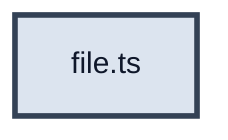

# ШАБЛОН: CURRENT_INCREMENT.md

> Скопируй в `CURRENT_INCREMENT.md`. Удали строки с `>` перед коммитом.  
> Формат: [PRACTICE_MODE.md](../guides/PRACTICE_MODE.md). Аналогии: [ANALOGY_GUIDE.md](../guides/ANALOGY_GUIDE.md).

---

# US X.X.X — [Название]

**Статус:** `active`  
**Релиз:** [CURRENT_RELEASE.md](../CURRENT_RELEASE.md)  
**Полная спека:** [CURRENT_RELEASE.md](../CURRENT_RELEASE.md) — § US X.X.X *(скопируй секцию в INCREMENT + добавь WIP-прогресс)*  
**Справочник:** [auth/AUTH_REFERENCE.md](../auth/AUTH_REFERENCE.md) *(если auth)*  
**Issue:** `#N` — `npm run _ create-task "US X.X.X: …"`

> **Сейчас:** …  
> **Готово:** …

> **Не в этом US:** …

---

## Прогресс

| Файл | Статус |
| ---- | ------ |
| `path/to/file.ts` | ⏳ / ✅ |

---

## На схеме

**Мастер-схема:** … (§A / §D в AUTH_REFERENCE)

**В этом US:**

| Файл | Действие |
| ---- | -------- |
| `file.ts` | новый / изменить |

**Не в этом US:** …

**После US:** …  
**Сцена timeline:** …  
**Полная карта:** [AUTH_REFERENCE.md](./auth/AUTH_REFERENCE.md)

| Статус | Фон | Обводка | Текст |
| ------ | --- | ------- | ----- |
| done | нет (default) | тонкая `#64748b` | default |
| **active (WIP)** | `#dce4ef` | жирная `#334155` | `#0f172a` |
| later | `#94a3b8` | тонкая `#64748b` | `#0f172a` |

> `classDef` — только внутри полного `flowchart` блока; не выносить отдельным mermaid-блоком.



---

## Контракты

> Сигнатуры, типы и HTTP-контракты **без реализации**. Детали сборки — в «Практика».

```typescript
export type Example = { id: string }

export function example(input: string): Promise<Example>
```

| Endpoint | Body response | Кто вызывает |
| -------- | ------------- | ------------ |
| `GET /api/example` | `{ id }` | … |

**Подводные камни:** …

---

## Зачем этот US

2–3 предложения: место в auth-треке / релизе.

---

## Acceptance Criteria

- [ ] …

---

## Git

**Ветка:** `vX.X.X-*`  
**Issue:** `#N`

---

## Практика

> Формат: [PRACTICE_MODE.md](../guides/PRACTICE_MODE.md) — import map над экспортом (см. § Импорты); только сигнатуры и `//` комментарии внутри `{ }`.

### Порядок сборки

1. `file-a.ts` — …
2. `file-b.ts` — …

### Шаг 0: deps *(если нужны)*

```bash
pnpm --filter … add …
```

> #### Схема БД (до / после) *(перед `schema.ts`, если меняется SQLite)*
>
> ##### Before (baseline …)
>
> ```mermaid
> erDiagram
>   table_name {
>     TEXT id PK
>   }
> ```
>
> ##### After (после US X.X.X)
>
> ```mermaid
> erDiagram
>   table_name {
>     TEXT id PK
>   }
> ```
>
> ##### Таблица diff
>
> | | До | После US X.X.X |
> | --- | --- | --- |
> | Таблицы | … | … |
> | PRAGMA | … | … |
> | Связи | … | … |
>
> **Подводный камень:** …
>
> ##### Проверка визуально
>
> 1. … (шаги — [DB_SCHEMA_DIFF.md](../guides/DB_SCHEMA_DIFF.md))
>
> ### `server/src/db/schema.ts`
>
> ```typescript
> // ====== КОД ИЗ baseline … ======
> // ====== НОВЫЙ БЛОК US X.X.X ======
> ```

### `path/to/file.ts`

```typescript
// ====== КОД ИЗ baseline (без изменений) ======
// …

// ====== НОВЫЙ/ИЗМЕНЁННЫЙ БЛОК US X.X.X ======
import { something } from 'npm-package'
import { helper } from '@shared/api/helper'

export function example() {
  // Шаг 1: …
  // Кратко: …
}
```

**Подводный камень:** …

### React-компонент (с import map)

| Слой | Пример |
| ---- | ------ |
| npm deps | `react-hook-form`, `@hookform/resolvers/zod` |
| shared | `@shared/api/…` |
| pages/features | `@pages/…` / `@features/…` |
| app | `@app/providers/…` |

```tsx
import { zodResolver } from '@hookform/resolvers/zod'
import { useForm } from 'react-hook-form'
import { loginSchema, type LoginFormValues } from '@shared/api/authSchemas'

export function ExampleForm() {
  // const { register, handleSubmit, formState: { errors } } = useForm<LoginFormValues>({ resolver: zodResolver(loginSchema) })
  // Шаг 1: …
}
```

---

## Проверка и тесты

> US **не закрывается** без отмеченных `- [ ]` ниже. См. [PRACTICE_MODE.md](../guides/PRACTICE_MODE.md).

### Ручная (обязательно)

| # | Input | Output |
| - | ----- | ------ |
| 1 | … | … |

- [ ] сценарий 1
- [ ] сценарий 2

### Автотесты

- [ ] `path/file.test.ts` — что assert'ит

```typescript
import { MantineProvider } from '@mantine/core'
import { render, screen } from '@testing-library/react'
import userEvent from '@testing-library/user-event'
import { beforeEach, describe, expect, it } from 'vitest'
import { ExampleForm } from './ExampleForm'

describe('…', () => {
  it('…', () => {
    // Arrange / Act / Assert — комментариями
  })
})
```

```bash
pnpm --filter react-happy-news-client exec vitest run path/to/file.test.ts
```

---

## Запуск

```bash
# терминал 1
pnpm dev:server

# терминал 2 — curl / browser
…

pnpm --filter react-happy-news-server build   # type-check server (если backend)
pnpm test                                      # финал трека
```

```bash
git add …
git commit -m "feat: #N …"
```

---

## Самопроверка US

| # | Вопрос | Где в коде |
| - | ------ | ---------- |
| 1 | … | `file.ts` |

<details>
<summary>Эталоны</summary>
…
</details>

## Следующий US

Отметить шаг в [CURRENT_RELEASE.md](../CURRENT_RELEASE.md) → скопировать секцию следующего US из RELEASE в `CURRENT_INCREMENT.md` → добавить WIP-прогресс.

---

## Справочник (не в каждый CURRENT_INCREMENT)

Выноси в `AUTH_REFERENCE.md`: «На пальцах», Research, полная архитектура, банк самопроверки 20+.

**Mega запрещён** без `AUTH_REFERENCE.md` + разбивки US в `CURRENT_RELEASE.md` (auth-трек #1–#6).
