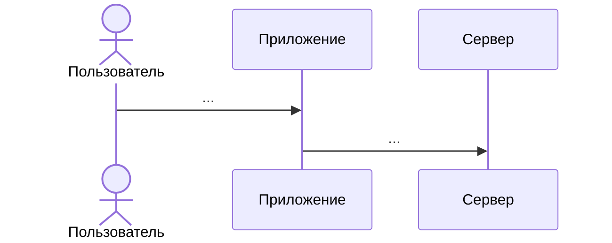
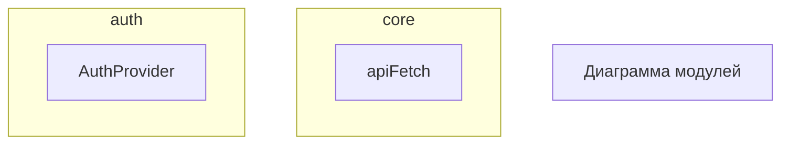

# ШАБЛОН: CURRENT_INCREMENT.md

> Скопируй этот файл в CURRENT_INCREMENT.md, заполни по инструкции ниже.
> Удали все строки с `>` перед коммитом.
> Аналогии — по [ANALOGY_GUIDE.md](../ANALOGY_GUIDE.md) (checklist + glossary).

---

# US X.X.X — [Название User Story]

**Статус:** `active`
**Релиз:** [CURRENT_RELEASE.md](./CURRENT_RELEASE.md)
**Issue:** `#N`  ← создать через: npm run _ create-task "US X.X.X: Название"
**Покрывает US:** X.X.1, … ← для mega-инкремента; иначе одна US
**Покрывает вопросы:** QN (тема), FQN (тема), …

> Вопросы берутся из ROADMAP.md раздела соответствующего релиза

**Acceptance Criteria:**

- [ ] ...

---

## На пальцах

> Бытовые аналогии **до** технических терминов. Читается за 3 минуты. Без кода.
> **Один домен** на инкремент (Auth — аэропорт; см. ANALOGY_GUIDE).
> Для mega — обязательно: timeline (mermaid sequence) + glossary + «где ломается».

### 1. Timeline — один день пользователя (главная diagram)

> Ось = **время**, не слои. Один узел = одна идея.



### 2. Глоссарий (таблица)

| Технический термин | В аналогии | В коде | Где ломается |
| ------------------ | ---------- | ------ | ------------ |
| … | … | `path/to/file` | … |

### 3. Компоненты — отдельные строки

| Компонент | В аналогии | Когда в timeline |
| --------- | ---------- | ---------------- |
| … | … | … |

### 4. Хранилища (если применимо)

| | В аналогии | Технически |
| --- | ---------- | ---------- |
| … | … | … |

---

## Research: сравнение подходов

> Таблица **до** реализации. **Топ-N + weighted score** для mega-инкрементов.
> Колонка «В аналогии» — опционально, только client-facing решения, один домен.

**Критерии (вес):** Fit 30%, Industry 20%, Portfolio 20%, Learning 15%, Cost 15%.

| # | Подход | Плюсы | Минусы | В аналогии (опц.) | Σ | Вердикт |
| - | ------ | ----- | ------ | ----------------- | - | ------- |
| 1 | … | … | … | … | ~X.X | ✅ / ❌ |

**Итог Research:**

> Одна строка: что выбрано и почему (без метафор).

---

## Концепция

> Технический flow: что происходит с точки зрения системы.
> Ссылка на timeline в «На пальцах». Plain language, без новых метафор.

```
Событие
  → следствие
  → следствие
```

**Перевод на код:** см. timeline + glossary.

**Почему [технология X], а не [альтернатива Y]:**

> Одно-два предложения.

---

## Решения и паттерны

| Решение | KISS / DRY / SOLID | Почему не альтернатива |
| ------- | ------------------ | ---------------------- |
| … | … | … |

---

## Git

**Ветка:** `vX.X.X-branch-name`
**Issue:** `#N`

---

## Архитектура

> **Module Map** (C4-lite) — без аналогий. См. [MODULE_MAP.md](../../architecture/MODULE_MAP.md).
> Минимум: 1 module diagram + 1 sequence (ключевой flow) + дерево файлов.
> Помечай: ← НОВЫЙ, ← ИЗМЕНИТЬ, ✅ уже есть



```
server/src/
└── ...

client/src/
├── pages/FeatureName/
│   ├── FeatureName.tsx
│   ├── lib/                 ← page-level VM
│   └── components/          ← widgets; hook colocated in components/<Name>/
├── model/news/{api,components,lib}/
├── shared/{api,config,components,lib}/
└── app/{layout,lib,mocks,providers}/
```

**Colocation rule:** extract to `features/` при 2+ consumer zones; `shared/` — только при 2+ zones.

---

## Фаза N: Название

> Для простых US — «## Шаг N». Для mega-инкрементов — «## Фаза N».

**Файлы:** `path/to/file.ts`

```typescript
// Сигнатуры и псевдокод:
// 1. Что принимает
// 2. Что возвращает
// 3. Ключевая логика (шаги, не код)
```

**Подводный камень:** …

**Тесты:**

- [ ] `path/to/file.test.ts` — что проверяет

```bash
git add <файлы фазы>
git commit -m "feat: #N <что сделано>"
```

> Повтори блок «## Фаза N» для каждой фазы

---

## Фаза ФИНАЛЬНАЯ: Закрыть инкремент

```bash
# 1. pnpm test && pnpm type-check && pnpm lint
# 2. (optional) pnpm gen:openapi:sync
# 3. Закрыть GitHub issue
gh issue close N --comment "US X.X.X завершён: <краткое описание>"

# 4. Обновить MODULE_MAP.md
# 5. Cursor → Plan mode → новый plan для следующего US
# 6. CURRENT_INCREMENT из этого шаблона
# 7. CURRENT_RELEASE.md + ROADMAP.md
# 8. Grep bookmark|закладк в docs → избранное/favorites (если применимо)

git add docs/
git commit -m "docs: US X.X.X DONE → US X.X.Y active (#N)"
```

### Самопроверка перед закрытием

- [ ] Ответил на ≥80% вопросов из «Самопроверка» без подглядывания в код
- [ ] Могу объяснить ключевые концепции **одной историей** из «На пальцах»
- [ ] Знаю, в каких файлах лежит основная логика
- [ ] (mega auth) Могу объяснить два токена через check-in → gate → kiosk

---

## Подводные камни

> Cross-cutting edge-cases для всего инкремента (не дублировать то, что уже в фазах):

- …

---

## Самопроверка: вопросы инкремента

> Пройди после всех фаз. Хороший ответ = **своими словами** + **где в коде**.
> Уровни 1–2 (mega auth): колонка **«В аналогии»** — 1 фраза + технический ответ.
> У простых US — 5–10 вопросов; у mega — полный банк (~25–30).

### Уровень 1 — Концепции

| # | Вопрос | В аналогии | Где в коде | ROADMAP |
| --- | ------ | ---------- | ---------- | ------- |
| 1 | … | … | `path/to/file` | QN |

<details>
<summary>Эталонный ответ (не открывать с первого раза)</summary>

…

</details>

### Уровень 2 — …

| # | Вопрос | В аналогии | Где в коде | ROADMAP |
| --- | ------ | ---------- | ---------- | ------- |
| … | … | … | … | … |

<details>
<summary>Эталонный ответ</summary>

…

</details>
